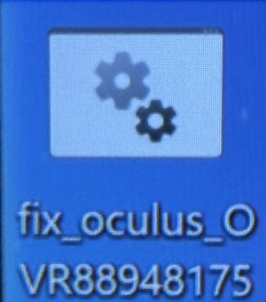
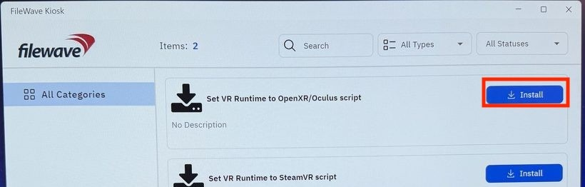
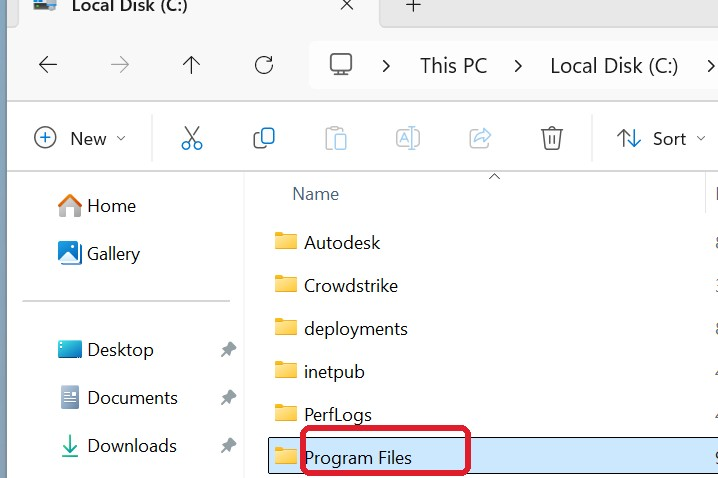
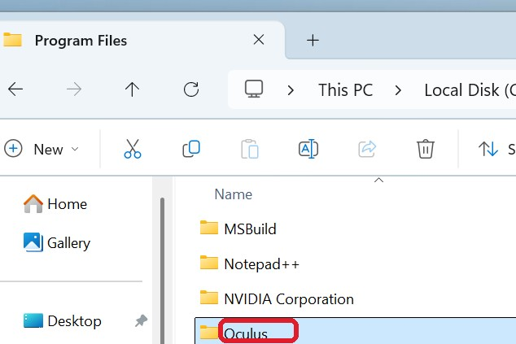
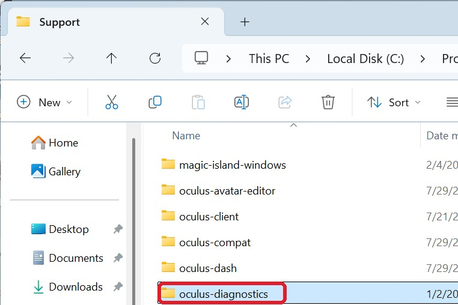
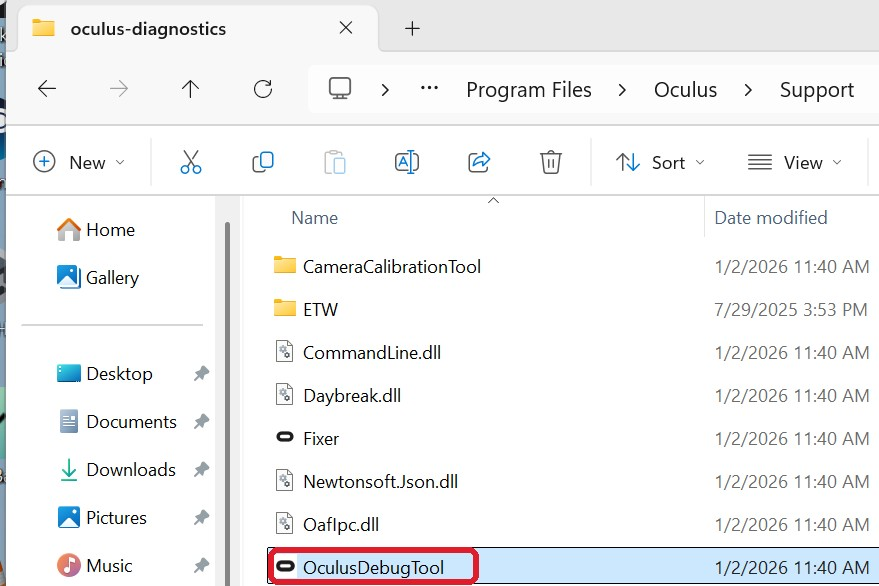
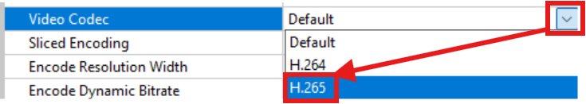
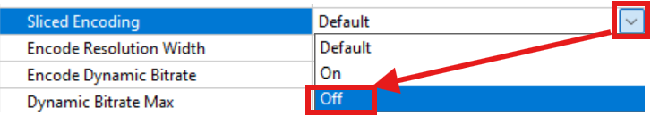
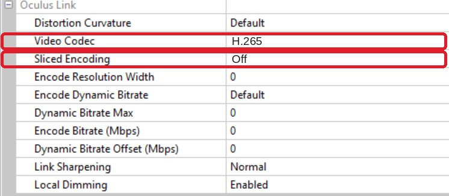

    
<h1 id="meta-quest-link-login-setup-flow">Meta Quest Link - Login &amp; Setup Flow</h1>
Prepare the PC - Fix, Runtime &amp; Codec

    

      

        Do these <b>before opening Meta Horizon Link</b>: run the fix, set the VR runtime, then switch the
        Link video codec to <b>H.265</b> in the Oculus Debug Tool. No admin rights needed.
      

      <!-- STEPS 1 + 2 -->
      

        

          

            

1

              
Run the fixDesktop shortcut

            <figure class="iconfig">
              
              <figcaption><b>fix_oculus_OVR88948175</b> grey gears icon</figcaption>
            </figure>
          

          

            

2

              
Set the VR runtimeFileWave Kiosk

            <figure class="sdfig">
              
              <figcaption>Click <b>Install</b> on <b>Set VR Runtime to OpenXR/Oculus</b> - or the <b>SteamVR</b> script if that is your target.</figcaption>
            </figure>
          

        

      

      

      <!-- STEP 3: debug tool / codec -->
      

        

3

          
Update the debugger settingsOculus Debug Tool

        
Find OculusDebugTool.exe - quit Meta Quest Link first

        

          <figure>1<figcaption>In <b>Local Disk (C:)</b>, open <b>Program Files</b></figcaption></figure>
          <figure>2<figcaption>Open <b>Oculus</b> (or <b>Meta Horizon</b>), then <b>Support</b></figcaption></figure>
          <figure>3<figcaption>In <b>Support</b>, open <b>oculus-diagnostics</b></figcaption></figure>
          <figure>4<figcaption>Double-click <b>OculusDebugTool</b></figcaption></figure>
        

        
Change two settings - under the "Oculus Link" section

        

          

            <figure class="setfig">5<figcaption>Set <b>Video Codec</b> to H.265</figcaption></figure>
            <figure class="setfig">6<figcaption>Set <b>Sliced Encoding</b> to Off</figcaption></figure>
            
Leave every other value as-is, then close the tool.

          

          <figure class="dtwin" style="margin:0;">
            
            <figcaption class="cap" style="text-align:center;font-size:10px;color:var(--muted);margin-top:4px;">Both rows sit together under the <b>Oculus Link</b> section.</figcaption>
          </figure>
        

      

      

        
<h3 id="good-to-know">Good to know</h3>
A <b>standard (non-admin) user</b> can make the codec change. The setting is <b>per user</b> on the <b>XRIML</b> or <b>RY324</b> PC. You should only need to do this <b>once for your user</b>, but it never hurts to re-check if the issue appears again.

        
<h3 id="what-to-expect">What to expect</h3>
This workaround is for <b>graphical issues</b> in the headset caused by <b>GPU driver errors</b>. The connection can be unstable at first, then settles - very little tearing, and no major artifacting.

      

      
Meta Quest Link - prepare the PC (steps 1-3)Page 1 of 2

    

  

