

    
<h1 id="meta-quest-link-login-setup-flow">Meta Quest Link - Login &amp; Setup Flow</h1>
Prepare the PC - Fix, Runtime &amp; Codec

    

      

        Do these <b>before opening Meta Horizon Link</b>: run the fix, set the VR runtime, then switch the
        Link video codec to <b>H.265</b> in the Oculus Debug Tool. No admin rights needed.
      

      <!-- STEPS 1 + 2 -->
      

        

          

            

1

              
Run the fixDesktop shortcut

            <figure class="iconfig">
              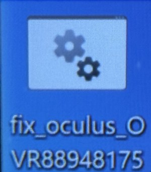
              <figcaption><b>fix_oculus_OVR88948175</b> grey gears icon</figcaption>
            </figure>
          

          

            

2

              
Set the VR runtimeFileWave Kiosk

            <figure class="sdfig">
              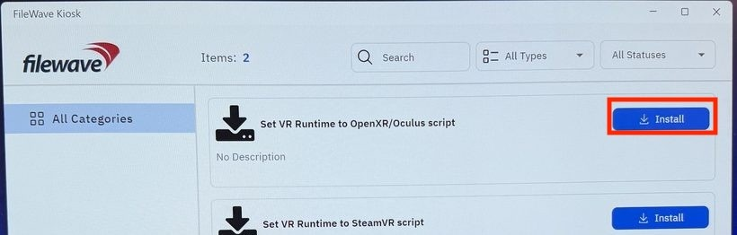
              <figcaption>Click <b>Install</b> on <b>Set VR Runtime to OpenXR/Oculus</b> - or the <b>SteamVR</b> script if that is your target.</figcaption>
            </figure>
          

        

      

      

      <!-- STEP 3: debug tool / codec -->
      

        

3

          
Update the debugger settingsOculus Debug Tool

        
Find OculusDebugTool.exe - quit Meta Quest Link first

        

          <figure>1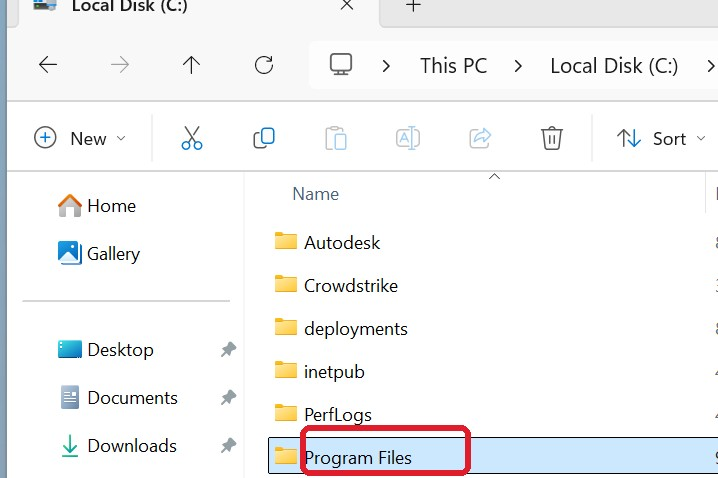<figcaption>In <b>Local Disk (C:)</b>, open <b>Program Files</b></figcaption></figure>
          <figure>2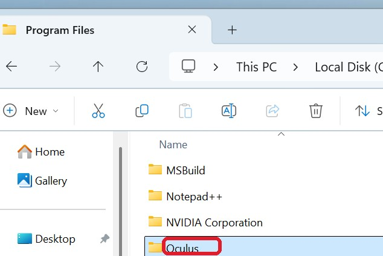<figcaption>Open <b>Oculus</b> (or <b>Meta Horizon</b>), then <b>Support</b></figcaption></figure>
          <figure>3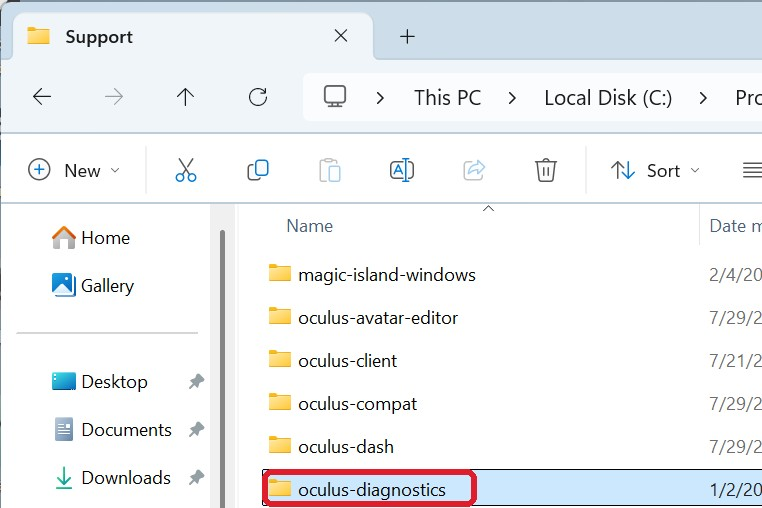<figcaption>In <b>Support</b>, open <b>oculus-diagnostics</b></figcaption></figure>
          <figure>4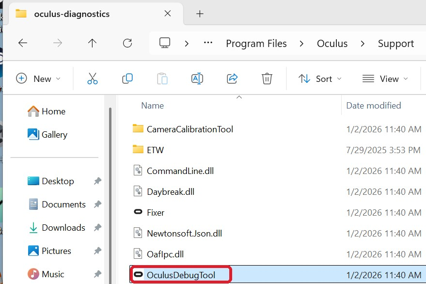<figcaption>Double-click <b>OculusDebugTool</b></figcaption></figure>
        

        
Change two settings - under the "Oculus Link" section

        

          

            <figure class="setfig">5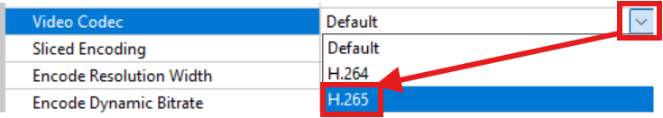<figcaption>Set <b>Video Codec</b> to H.265</figcaption></figure>
            <figure class="setfig">6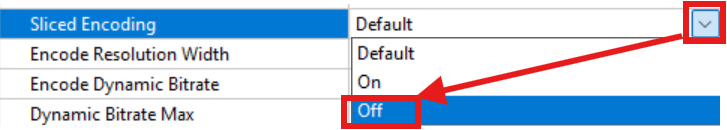<figcaption>Set <b>Sliced Encoding</b> to Off</figcaption></figure>
            
Leave every other value as-is, then close the tool.

          

          <figure class="dtwin" style="margin:0;">
            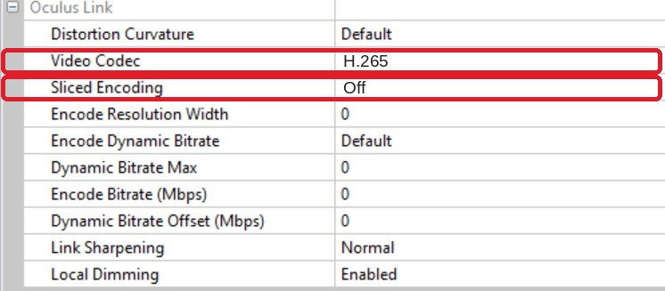
            <figcaption class="cap" style="text-align:center;font-size:10px;color:var(--muted);margin-top:4px;">Both rows sit together under the <b>Oculus Link</b> section.</figcaption>
          </figure>
        

      

      

        
<h3 id="good-to-know">Good to know</h3>
A <b>standard (non-admin) user</b> can make the codec change. The setting is <b>per user</b> on the <b>XRIML</b> or <b>RY324</b> PC. You should only need to do this <b>once for your user</b>, but it never hurts to re-check if the issue appears again.

        
<h3 id="what-to-expect">What to expect</h3>
This workaround is for <b>graphical issues</b> in the headset caused by <b>GPU driver errors</b>. The connection can be unstable at first, then settles - very little tearing, and no major artifacting.

      

      
Meta Quest Link - prepare the PC (steps 1-3)Page 1 of 2

    

  

    
<h1 id="meta-quest-link-login-setup-flow-2">Meta Quest Link - Login &amp; Setup Flow</h1>
Connect over Link - Settings &amp; Troubleshooting

    

      

        With the PC prepared (page 1), open <b>Meta Horizon Link</b>, turn on the settings below, then connect.
        If the PC and headset can't find each other, see the <b>troubleshooting</b> at the bottom.
      

      <!-- STEP 4 -->
      

        

4

          
Open Meta Horizon Link &amp; sign inDesktop app

        

          Launch the <b>Meta Horizon Link</b> desktop app and sign in. The <b>Developer</b> settings below need a
          <b>Meta developer account</b> - quick sign-up at <b>developers.meta.com/horizon/sign-up</b>.
        

      

      

      <!-- STEP 5 -->
      

        

5

          
Enable the Link settingsSettings &#9656; General and Developer tabs

        
General tab

        <figure class="sdfig" style="margin-bottom:10px;">
          
          <figcaption>Turn on <b>Unknown Sources</b> - lets apps that Meta has not reviewed run over Link.</figcaption>
        </figure>

        
Developer tab (needs a Meta developer account)

        

          <figure class="mhlfig" style="margin:0;">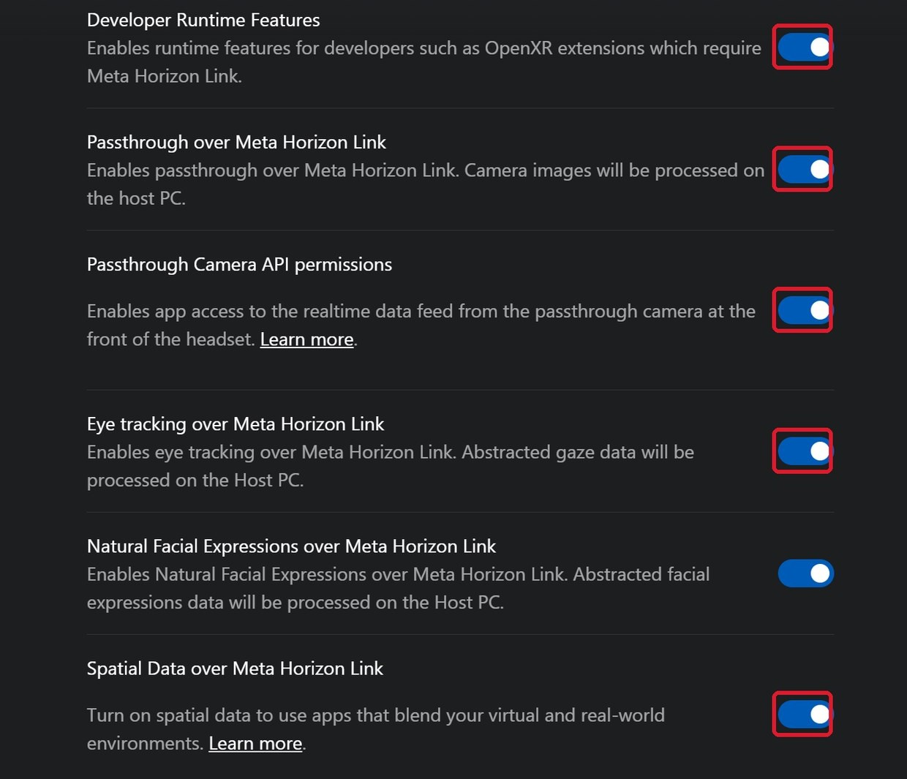</figure>
          

            <ul class="chklist">
              <li><b>Developer Runtime Features</b></li>
              <li><b>Passthrough</b> over Meta Horizon Link</li>
              <li><b>Passthrough Camera API</b> permissions</li>
              <li><b>Eye tracking</b> over Meta Horizon Link</li>
              <li><b>Spatial Data</b> over Meta Horizon Link</li>
              <li class="opt">Natural Facial Expressions <i>(optional)</i></li>
            </ul>
          

        

      

      

      <!-- STEP 6 -->
      

        

6

          
Launch &amp; connectEnable Link on the headset

        

          

            Start your app, <b>SteamVR</b>, or your dev platform. Put on the headset - when the
            <b>Enable Link</b> prompt appears, select <b>Enable</b>. No prompt? <b>Unplug and replug</b> the cable to make it reappear.
          

          <figure class="hmdfig">
            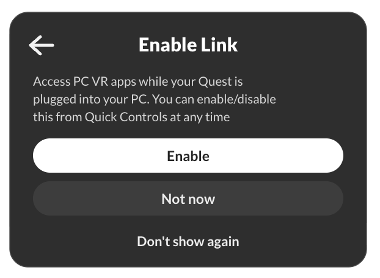
            <figcaption>The on-headset Enable Link prompt.</figcaption>
          </figure>
        

      

      

      <!-- Troubleshooting - last -->
      

        

?

          
TroubleshootingIf the PC and Headset can't find each other / won't connect!

        <ul class="rows" style="margin-top:2px;">
          <li style="align-items:center;">RE-CHECK
Confirm <b>Video Codec = H.265</b> and <b>Sliced Encoding = Off</b> in OculusDebugTool.exe (page 1).
</li>
          <li style="align-items:center;">RESTART
Restart <b>both</b> the PC and the headset - the settings are saved across restarts.
</li>
          <li style="align-items:center;">RECONNECT
Open <b>Link</b> again; the PC and headset should re-pair.
</li>
        </ul>
      

      
Meta Quest Link - connect over Link (steps 4-6)Page 2 of 2

    

  

