<section class="page" id="p1">
  
Unity 6000.3.23f1

  

    
  

  <h1 id="meta-xr-sdk-unity-6-quest-3mixed-reality-quick-start-guide" class="cover-title">Meta XR SDK + Unity 6 + Quest 3 Mixed Reality Quick Start Guide</h1>
  

  <h2 id="index" class="index-h">Index</h2>
  <nav class="toc">
    <ul>
      <li>
        <a class="t1" href="#p2">&#9679; Requirements - Page 2</a>
        <ul class="t2"><li>What you need before you begin</li></ul>
      </li>
      <li>
        <a class="t1" href="#p3">&#9679; The Unity Editor at a Glance - Page 3</a>
        <ul class="t2"><li>A quick tour of the default panels</li></ul>
      </li>
      <li>
        <a class="t1" href="#p4">&#9679; Connect the Headset to the PC - Page 4</a>
        <ul class="t2"><li>Link cable connection and cable safety</li></ul>
      </li>
      <li>
        <a class="t1" href="#p5">&#9679; Getting Started: Lab Setup - Page 5</a>
        <ul class="t2"><li>FileWave Kiosk runtime, sign-ins, fix-oculus, Meta Horizon Link settings</li></ul>
      </li>
      <li>
        <a class="t1" href="#p8">&#9679; Project &amp; the Meta XR SDK - Page 8</a>
        <ul class="t2"><li>Create the project, install the All-in-One SDK, what the tools do</li></ul>
      </li>
      <li>
        <a class="t1" href="#p20">&#9679; Configure &amp; Add Building Blocks - Page 20</a>
        <ul class="t2"><li>Project Setup Tool, Camera Rig, passthrough, hands, grabbable cube</li></ul>
      </li>
      <li>
        <a class="t1" href="#p28">&#9679; Hierarchy, Build &amp; Test - Page 28</a>
        <ul class="t2"><li>Check hierarchy, build and run, run over Link, test on Quest 3</li></ul>
      </li>
      <li>
        <a class="t1" href="#p32">&#9679; Troubleshooting - Page 32</a>
        <ul class="t2"><li>Common failures and where to look first</li></ul>
      </li>
      <li>
        <a class="t1" href="#p34">&#9679; Pre-Build Checklist - Page 34</a>
        <ul class="t2"><li>Everything to confirm before you build</li></ul>
      </li>
    </ul>
  </nav>

  

    

      
Additional Notes:

      
A friendly, beginner-first walkthrough for building your first Meta Quest 3 Mixed Reality scene in Unity 6 using the <b>Meta XR SDK</b>. The <b>Project Setup Tool</b> configures the project and <b>Building Blocks</b> drop in passthrough, controllers, hand tracking and a grabbable cube - so there are far fewer manual steps than the OpenXR route. Built with Unity 6000.3.23f1.

    

    

Lab Email:

camdimmersivemedialab@northeastern.edu

    

XRIML Versioning:

8/26/2026

    

Lab Phone:

617-373-4400

  

  
XR IMMERSIVE MEDIA LABPage 1

</section>
<section class="page" id="p2">

Unity 6000.3.23f1

<h2 id="requirements" class="ptitle two">Requirements</h2>

Before you begin, make sure the station has everything below. On the lab machines most of this is already set up for you. The Meta XR SDK itself gets installed later, inside the guide.

<ul class="reqlist">
<li>A lab PC in the <b>XR Immersive Media Lab</b> (XRIML) or <b>Ryder 324</b>, turned on</li>
<li>A <b>Meta Quest 3</b> headset with a boundary set up (Stationary in RY324; Roomscale or Stationary in XRIML)</li>
<li>Two <b>controllers</b> with charged batteries</li>
<li>A <b>USB-C to USB-C link cable</b> (if it isn't already attached to the station)</li>
<li>Your <b>Northeastern email and password</b> for signing in to Unity</li>
<li>A <b>Meta developer account</b> - not just a regular Meta account (developers.meta.com/horizon/sign-up)</li>
<li><b>Unity 6</b> installed via Unity Hub - <b>6.1 or newer</b> is recommended for Building Blocks; this guide uses 6000.3.23f1</li>
</ul>

XR IMMERSIVE MEDIA LABPage 2

</section>
<section class="page" id="p3">

Unity 6000.3.23f1

<h2 id="the-unity-editor-at-a-glance" class="ptitle two">The Unity Editor at a Glance</h2>

Before diving in, here is a quick map of the Unity editor. By default it opens with the panels below, and you will use all of them in this guide. The one to know first is the <b>Inspector</b> on the right, where a selected object's components appear.

<svg viewBox="0 0 600 262" xmlns="http://www.w3.org/2000/svg" font-family="Lato,Helvetica,Arial,sans-serif"><rect x="4" y="4" width="592" height="254" rx="9" fill="#2d2d2d" stroke="#6d6d6d" stroke-width="1.5"/><path d="M4 13 a9 9 0 0 1 9 -9 h574 a9 9 0 0 1 9 9 v17 h-592 z" fill="#484848"/><g fill="#9a9a9a"><rect x="44" y="10" width="12" height="12" rx="2"/><circle cx="70" cy="16" r="6"/></g><g fill="#d2d2d2"><polygon points="286,9 286,24 299,16.5"/><rect x="307" y="9" width="5" height="15"/><rect x="315" y="9" width="5" height="15"/><polygon points="330,9 330,24 340,16.5"/><rect x="340" y="9" width="4" height="15"/></g><g fill="#9a9a9a"><rect x="512" y="10" width="30" height="12" rx="2"/><rect x="550" y="10" width="30" height="12" rx="2"/></g><rect x="12" y="40" width="128" height="150" rx="4" fill="#3a3a3a" stroke="#585858"/><rect x="12" y="40" width="128" height="19" rx="4" fill="#484848"/><text x="40" y="53" fill="#eaeaea" font-size="11" font-weight="700">Hierarchy</text><g fill="#cccccc" font-size="8.5"><text x="22" y="76">SampleScene</text><text x="30" y="91">Directional Light</text><text x="30" y="106">Camera Rig</text><text x="30" y="121">Passthrough</text><text x="30" y="136">Plane</text><text x="30" y="151">Cube</text></g><rect x="148" y="40" width="298" height="150" rx="4" fill="#313131" stroke="#585858"/><rect x="148" y="40" width="298" height="19" rx="4" fill="#3c3c3c"/><text x="178" y="53" fill="#fff" font-size="11" font-weight="700">Scene</text><text x="224" y="53" fill="#8f8f8f" font-size="11">Game</text><polygon points="312,126 418,158 312,190 206,158" fill="#565656" stroke="#676767" stroke-width="1" stroke-linejoin="round"/><g stroke="#616161" stroke-width="0.75"><line x1="206" y1="158" x2="418" y2="158"/><line x1="312" y1="126" x2="312" y2="190"/></g><g stroke="#24346b" stroke-width="0.8" stroke-linejoin="round"><polygon points="286,131 312,146 312,174 286,159" fill="#3f6fd6"/><polygon points="312,146 338,131 338,159 312,174" fill="#2b4f9e"/><polygon points="312,116 338,131 312,146 286,131" fill="#6a92ee"/></g><rect x="151" y="56" width="22" height="134" rx="6" fill="#2a2a2a" stroke="#5a5a5a"/><g stroke="#8f8f8f" stroke-width="1.3"><line x1="157" y1="60" x2="167" y2="60"/><line x1="157" y1="62.4" x2="167" y2="62.4"/></g><g stroke="#cfcfcf" stroke-width="0.9" fill="none"><path d="M156.5,68 l3,-1.7 l3,1.7 l0,3.4 l-3,1.7 l-3,-1.7 z"/><path d="M156.5,68 l3,1.7 l3,-1.7 M159.5,69.7 l0,3.4"/></g><polygon points="165.5,68.5 169,68.5 167.25,71" fill="#cfcfcf"/><rect x="154" y="78" width="16" height="16" rx="3" fill="#454545"/><g fill="#e8e8e8"><rect x="159" y="86" width="6.2" height="5.6" rx="2.4"/><rect x="159.2" y="82.2" width="1.5" height="5" rx="0.7"/><rect x="160.9" y="81.2" width="1.5" height="6" rx="0.7"/><rect x="162.6" y="81.4" width="1.5" height="5.8" rx="0.7"/><rect x="164.2" y="82.6" width="1.5" height="4.6" rx="0.7"/><rect x="156.7" y="85.2" width="1.5" height="3.6" rx="0.7" transform="rotate(-38 157.4 87)"/></g><rect x="154" y="96" width="16" height="16" rx="3" fill="#3b6098"/><g stroke="#fff" stroke-width="1.3"><line x1="162" y1="100" x2="162" y2="108"/><line x1="158" y1="104" x2="166" y2="104"/></g><g fill="#fff"><polygon points="162,98.5 159.6,101 164.4,101"/><polygon points="162,109.5 159.6,107 164.4,107"/><polygon points="156.5,104 159,101.6 159,106.4"/><polygon points="167.5,104 165,101.6 165,106.4"/></g><rect x="154" y="114" width="16" height="16" rx="3" fill="#454545"/><g stroke="#dcdcdc" stroke-width="1.2" fill="none"><path d="M165,119.5 a4.1,4.1 0 0 1 -0.6,6"/><path d="M159,126.5 a4.1,4.1 0 0 1 0.6,-6"/></g><g fill="#dcdcdc"><polygon points="165.4,119 162.6,118.6 164.4,121.2"/><polygon points="158.6,127 161.4,127.4 159.6,124.8"/></g><rect x="154" y="132" width="16" height="16" rx="3" fill="#454545"/><rect x="156.6" y="141.4" width="4.6" height="4.6" rx="0.6" fill="none" stroke="#dcdcdc" stroke-width="1.1"/><line x1="161" y1="141" x2="166.6" y2="135.4" stroke="#dcdcdc" stroke-width="1.2"/><polygon points="167.4,134.6 163.4,135.2 166.2,138" fill="#dcdcdc"/><rect x="154" y="150" width="16" height="16" rx="3" fill="#454545"/><rect x="157.4" y="155" width="9.2" height="7.4" fill="none" stroke="#dcdcdc" stroke-width="0.9" stroke-dasharray="2 1.5"/><g fill="#dcdcdc"><rect x="156" y="153.6" width="2.6" height="2.6" rx="0.4"/><rect x="165.4" y="153.6" width="2.6" height="2.6" rx="0.4"/><rect x="156" y="161.2" width="2.6" height="2.6" rx="0.4"/><rect x="165.4" y="161.2" width="2.6" height="2.6" rx="0.4"/></g><rect x="154" y="168" width="16" height="16" rx="3" fill="#454545"/><circle cx="162" cy="176" r="4.4" fill="none" stroke="#dcdcdc" stroke-width="1"/><g stroke="#dcdcdc" stroke-width="1"><line x1="162" y1="172.4" x2="162" y2="179.6"/><line x1="158.4" y1="176" x2="165.6" y2="176"/></g><g fill="#dcdcdc"><polygon points="162,171 160.6,173 163.4,173"/><polygon points="162,181 160.6,179 163.4,179"/><polygon points="157,176 159,174.6 159,177.4"/><polygon points="167,176 165,174.6 165,177.4"/></g><g stroke="#9a9a9a" stroke-width="0.9" fill="none"><path d="M156.4,171.4 l0,-1.4 l1.4,0"/><path d="M167.6,171.4 l0,-1.4 l-1.4,0"/><path d="M156.4,180.6 l0,1.4 l1.4,0"/><path d="M167.6,180.6 l0,1.4 l-1.4,0"/></g><rect x="452" y="40" width="136" height="150" rx="4" fill="#3a3a3a" stroke="#585858"/><rect x="452" y="40" width="136" height="19" rx="4" fill="#484848"/><text x="492" y="53" fill="#eaeaea" font-size="11" font-weight="700">Inspector</text><text x="462" y="76" fill="#cccccc" font-size="8.5">Component</text><rect x="524" y="67" width="56" height="12" rx="2" fill="#2a2a2a" stroke="#555"/><text x="462" y="96" fill="#cccccc" font-size="8.5">Component</text><rect x="524" y="87" width="56" height="12" rx="2" fill="#2a2a2a" stroke="#555"/><text x="462" y="116" fill="#cccccc" font-size="8.5">Component</text><rect x="524" y="107" width="56" height="12" rx="2" fill="#2a2a2a" stroke="#555"/><text x="462" y="136" fill="#cccccc" font-size="8.5">Component</text><rect x="524" y="127" width="56" height="12" rx="2" fill="#2a2a2a" stroke="#555"/><text x="462" y="156" fill="#cccccc" font-size="8.5">Component</text><rect x="524" y="147" width="56" height="12" rx="2" fill="#2a2a2a" stroke="#555"/><rect x="12" y="198" width="576" height="52" rx="4" fill="#3a3a3a" stroke="#585858"/><rect x="12" y="198" width="576" height="19" rx="4" fill="#484848"/><text x="40" y="211" fill="#fff" font-size="11" font-weight="700">Project</text><text x="92" y="211" fill="#8f8f8f" font-size="11">Console</text><g fill="#c9a24a"><rect x="30" y="226" width="20" height="15" rx="2"/><rect x="72" y="226" width="20" height="15" rx="2"/><rect x="114" y="226" width="20" height="15" rx="2"/><rect x="156" y="226" width="20" height="15" rx="2"/><rect x="198" y="226" width="20" height="15" rx="2"/></g><circle cx="22" cy="16" r="10" fill="#D41B2C"/><text x="22" y="20" fill="#fff" font-size="12" font-weight="900" text-anchor="middle">1</text><circle cx="26" cy="49" r="10" fill="#D41B2C"/><text x="26" y="53" fill="#fff" font-size="12" font-weight="900" text-anchor="middle">2</text><circle cx="430" cy="49" r="10" fill="#D41B2C"/><text x="430" y="53" fill="#fff" font-size="12" font-weight="900" text-anchor="middle">3</text><circle cx="190" cy="89" r="10" fill="#D41B2C"/><text x="190" y="93" fill="#fff" font-size="12" font-weight="900" text-anchor="middle">4</text><circle cx="466" cy="49" r="10" fill="#D41B2C"/><text x="466" y="53" fill="#fff" font-size="12" font-weight="900" text-anchor="middle">5</text><circle cx="26" cy="208" r="10" fill="#D41B2C"/><text x="26" y="212" fill="#fff" font-size="12" font-weight="900" text-anchor="middle">6</text></svg>

<ol class="ovlist"><li>1<b>Toolbar</b> - <b>Play</b>, <b>Pause</b> and <b>Step</b> controls for entering Play mode, plus the layout and account menus.</li><li>2<b>Hierarchy</b> - Every GameObject in the open scene, shown as an expandable tree.</li><li>3<b>Scene &amp; Game view</b> - <b>Scene</b> is where you build and arrange objects in 3D; <b>Game</b> previews what the headset shows.</li><li>4<b>Scene view tools</b> - The floating overlay in the Scene view: <b>Hand</b> (pan), <b>Move</b>, <b>Rotate</b>, <b>Scale</b> and <b>Rect</b> tools for positioning objects.</li><li>5<b>Inspector</b> - The properties and <b>components</b> of whatever you have selected - docked on the right by default.</li><li>6<b>Project &amp; Console</b> - <b>Project</b> holds all your assets (folders, prefabs, materials, samples); <b>Console</b> shows Unity's messages, warnings and errors.</li></ol>

XR IMMERSIVE MEDIA LABPage 3

</section>
<section class="page" id="p4">

Unity 6000.3.23f1

<h2 id="connect-the-headset-to-the-pc" class="ptitle">Connect the Headset to the PC</h2>

1
<h3 id="step-1">Connect the link cable</h3>
Grab the <b>USB-C link cable</b> and connect the PC to the headset. In the XRIML lab you'll find it hanging from the ceiling pulley system by the PC; over in Ryder 324 it's beside the keyboard and monitor. Take a second to secure the cable to the headset with the <b>velcro</b> strap.

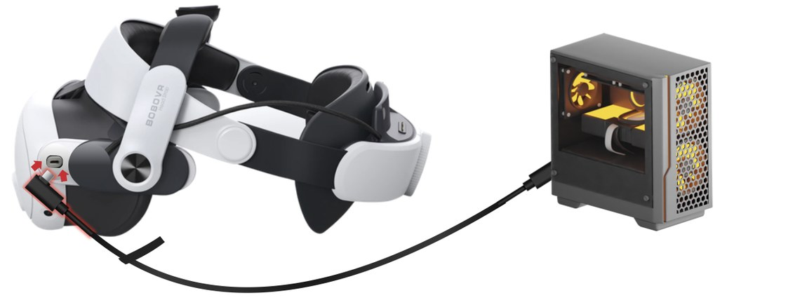

Plug the USB-C link cable into the headset and the PC; secure it with velcro.

Always use the velcro

        
Securing the cable to the headset protects the USB-C port from damage and keeps the cable from breaking. You'll enable Link later, when you press Play or Build (Steps 22-23).

XR IMMERSIVE MEDIA LABPage 4

</section>
<section class="page" id="p5">

Unity 6000.3.23f1

<h2 id="getting-started-lab-setup" class="ptitle">Getting Started: Lab Setup</h2>

2
<h3 id="step-2">Install the VR runtime from FileWave Kiosk</h3>
Open the <b>FileWave Kiosk</b> app and hit <b>Install</b> on &ldquo;<b>Set VR Runtime to OpenXR/Oculus script</b>.&rdquo; This quietly points the system's VR runtime at OpenXR, so Unity and the headset speak the same language from the start.

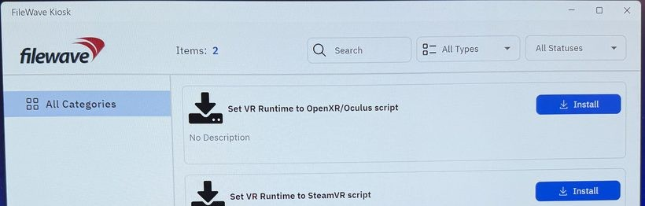

FileWave Kiosk - install &ldquo;Set VR Runtime to OpenXR/Oculus script.&rdquo;

3
<h3 id="step-3">Run the fix-oculus shortcut</h3>
On the desktop, run the fix_oculus_OVR88948175 shortcut - the tile with the grey gears. It clears the common Oculus/OpenXR runtime error and sets the Meta runtime active before you start.

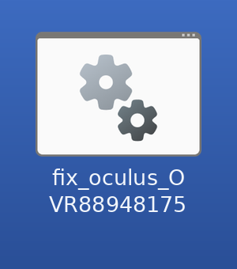

Desktop shortcut: fix_oculus_OVR88948175

XR IMMERSIVE MEDIA LABPage 5

</section>
<section class="page" id="p6">

Unity 6000.3.23f1

<h2 id="getting-started-lab-setup-cont" class="ptitle">Getting Started: Lab Setup (cont.)</h2>

4
<h3 id="step-4">Sign in to Unity and Meta Horizon Link</h3>
Sign in to <b>Unity</b>, then open the <b>Meta Horizon Link</b> desktop app and sign in there too. Some <b>Meta SDK</b> development features in Unity require a <b>Meta developer account</b>, not a regular Meta account.

5
<h3 id="step-5">Enable the Meta Horizon Link settings</h3>
In the <b>Meta Horizon Link</b> desktop app, open <b>Settings</b> and flip on the toggles below.

1
<h4 id="general-tab">General tab</h4>

<ul><li>Turn on <b>Unknown Sources</b> (at the bottom of the General tab)</li></ul>

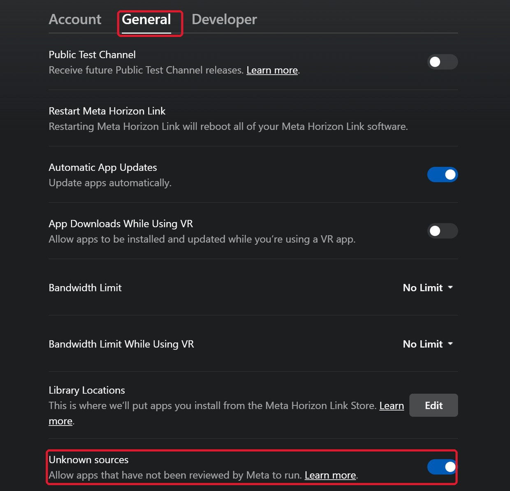

General &rarr; Unknown Sources.

XR IMMERSIVE MEDIA LABPage 6

</section>
<section class="page" id="p7">

Unity 6000.3.23f1

<h2 id="getting-started-lab-setup-cont-2" class="ptitle">Getting Started: Lab Setup (cont.)</h2>

Step 5 (continued)

2
<h4 id="developer-tab">Developer tab</h4>

<ul><li><b>Developer Runtime Features</b></li><li><b>Passthrough over Meta Horizon Link</b></li><li><b>Passthrough Camera API</b> permissions</li><li><b>Eye tracking over Meta Horizon Link</b></li><li><b>Spatial data over Meta Horizon Link</b></li><li>Natural Facial Expressions <i>(optional)</i></li></ul>

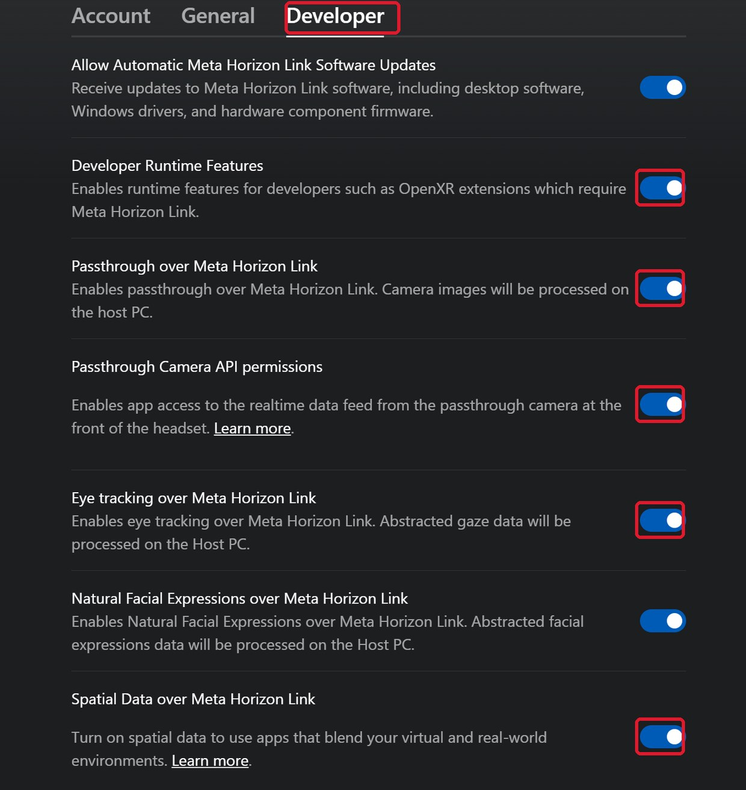

Developer &rarr; enable the boxed toggles.

Needs a Meta developer account

The Developer tab options only appear once you have a Meta developer account - a quick sign-up at developers.meta.com/horizon/sign-up.

XR IMMERSIVE MEDIA LABPage 7

</section>
<section class="page" id="p8">

Unity 6000.3.23f1

<h2 id="project-the-meta-xr-sdk" class="ptitle">Project &amp; the Meta XR SDK</h2>

6
<h3 id="step-6">Create the Unity project</h3>
Spin up a new Unity project with the <b>Universal 3D</b> template. For reference, this guide was built with Unity 6000.3.23f1.

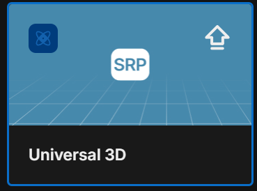

In Unity Hub's <b>New Project</b> dialog, pick the <b>Universal 3D</b> template.

7
<h3 id="step-7">Delete the default Main Camera</h3>
The Universal 3D template opens with a <b>Main Camera</b> in the scene. If yours has one, right-click it in the <b>Hierarchy</b> and choose <b>Delete</b> - the Camera Rig you add later brings its own camera, and two cameras would fight.

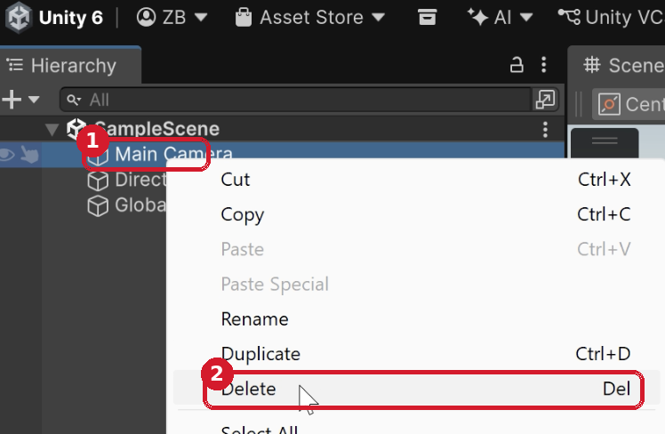

Right-click <b>Main Camera</b> (1) in the Hierarchy and choose <b>Delete</b> (2).

XR IMMERSIVE MEDIA LABPage 8

</section>
<section class="page" id="p9">

Unity 6000.3.23f1

<h2 id="project-the-meta-xr-sdk-cont" class="ptitle">Project &amp; the Meta XR SDK (cont.)</h2>

8
<h3 id="step-8">Add a virtual floor</h3>
Give the scene a floor for objects to rest on. From the menu, choose GameObject &rarr; 3D Object &rarr; Plane and leave it at (0, 0, 0). A Plane already includes a Mesh Collider.

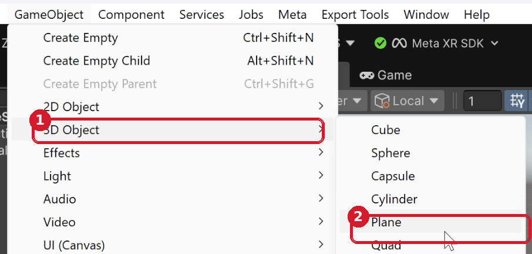

<b>GameObject &rarr; 3D Object &rarr; Plane</b>.

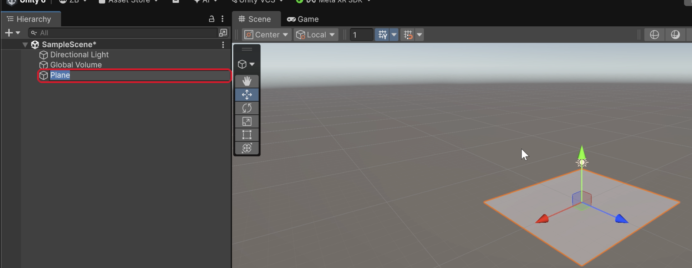

The <b>Plane</b> appears in the Hierarchy, sitting at the origin.

XR IMMERSIVE MEDIA LABPage 9

</section>
<section class="page" id="p10">

Unity 6000.3.23f1

<h2 id="project-the-meta-xr-sdk-cont-2" class="ptitle">Project &amp; the Meta XR SDK (cont.)</h2>

9
<h3 id="step-9">Switch the project to Android</h3>
The Quest runs Android, so set the build target now. Go to File &rarr; Build Profiles, pick <b>Android</b>, and click Switch Platform. Unity reimports assets for the new target - give it a minute. Everything you configure next then applies to the Quest build.

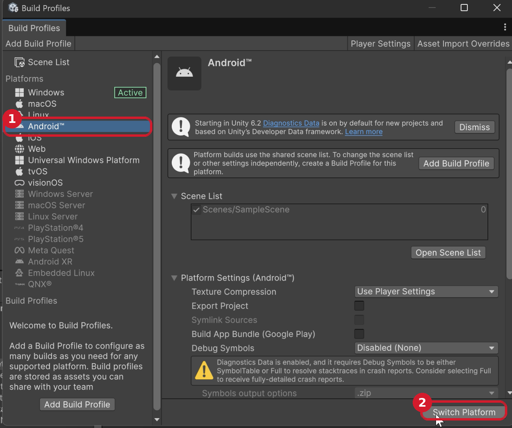

In <b>Build Profiles</b>, pick <b>Android</b> (1), then click <b>Switch Platform</b> (2).

XR IMMERSIVE MEDIA LABPage 10

</section>
<section class="page" id="p11">

Unity 6000.3.23f1

<h2 id="project-the-meta-xr-sdk-cont-3" class="ptitle">Project &amp; the Meta XR SDK (cont.)</h2>

10
<h3 id="step-10">Install XR Plugin Management</h3>
Open Edit &rarr; Project Settings and select <b>XR Plugin Management</b> at the bottom of the list. Click Install XR Plugin Management. This is the framework the Meta XR SDK builds on, so it needs to be in place first.

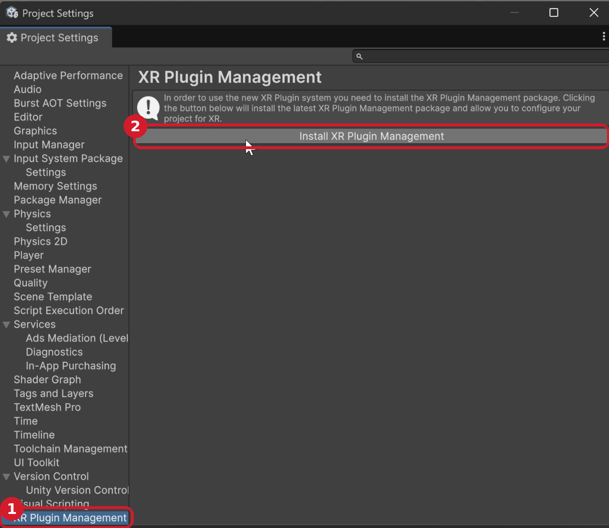

In <b>Project Settings &rarr; XR Plugin Management</b> (1), click <b>Install XR Plugin Management</b> (2).

XR IMMERSIVE MEDIA LABPage 11

</section>
<section class="page" id="p12">

Unity 6000.3.23f1

<h2 id="project-the-meta-xr-sdk-cont-4" class="ptitle">Project &amp; the Meta XR SDK (cont.)</h2>

11
<h3 id="step-11">Install the Meta XR SDK</h3>
The <b>Meta XR All-in-One SDK</b> comes from the Unity Asset Store (listed there as <b>Meta XR SDK</b>). You add it to your Unity account in a browser, then install it into the project.

1
<h4 id="add-it-to-your-assets">Add it to your assets</h4>
In a browser, open assetstore.unity.com/packages/sdk/meta-xr-sdk-9022845 and click <b>Add to My Assets</b>.

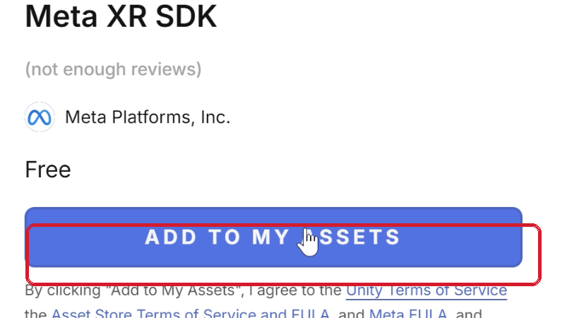

2
<h4 id="sign-in-with-a-unity-account">Sign in with a Unity account</h4>
When prompted, sign in with a <b>Unity account</b>.

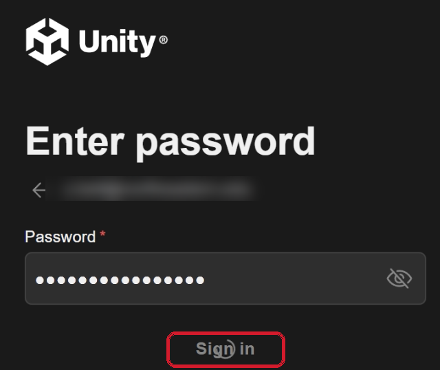

XR IMMERSIVE MEDIA LABPage 12

</section>
<section class="page" id="p13">

Unity 6000.3.23f1

<h2 id="project-the-meta-xr-sdk-cont-5" class="ptitle">Project &amp; the Meta XR SDK (cont.)</h2>

Step 11 (continued)

3
<h4 id="open-in-unity">Open in Unity</h4>
Back on the Asset Store page the button changes to <b>Open in Unity</b> - click it.

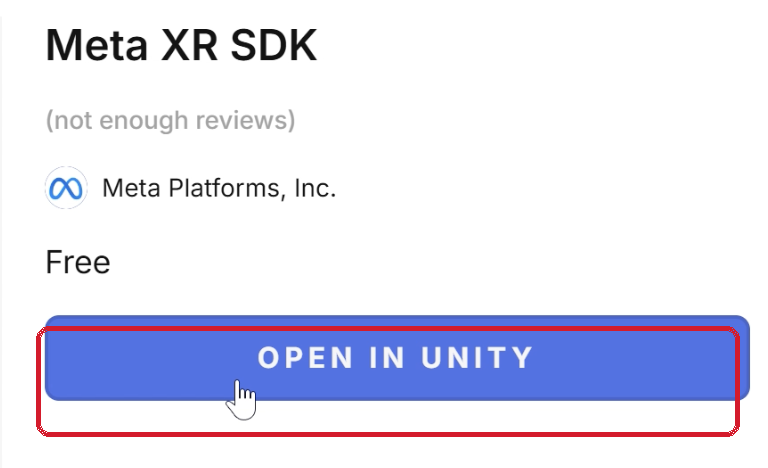

4
<h4 id="let-the-browser-open-unity">Let the browser open Unity</h4>
Your browser asks to open the Unity Editor. Click <b>Open</b>.

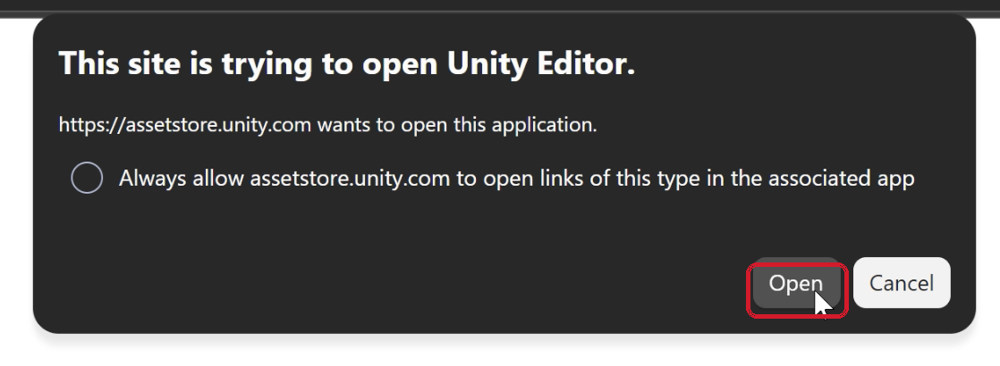

5
<h4 id="install-in-the-package-manager">Install in the Package Manager</h4>
Unity opens the <b>Package Manager</b> on <b>My Assets</b>. Select <b>Meta XR All-in-One SDK</b> and click <b>Install</b>.

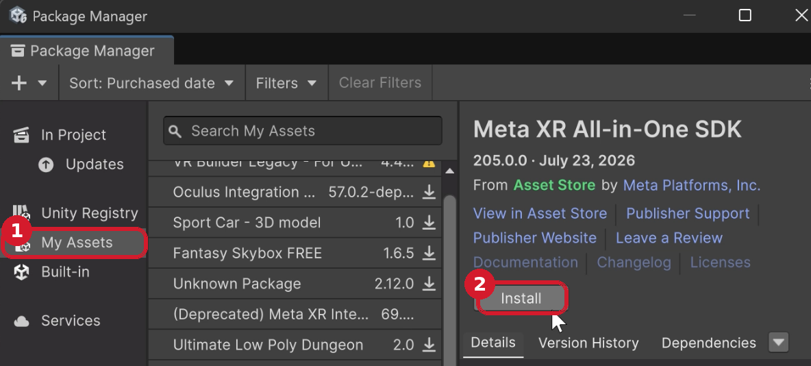

XR IMMERSIVE MEDIA LABPage 13

</section>
<section class="page" id="p14">

Unity 6000.3.23f1

<h2 id="project-the-meta-xr-sdk-cont-6" class="ptitle">Project &amp; the Meta XR SDK (cont.)</h2>

Step 11 (continued)

6
<h4 id="enable-the-meta-xr-feature-set">Enable the Meta XR Feature Set</h4>
When the install finishes, Unity asks to enable the Meta XR Feature Set in OpenXR. Click <b>Yes</b>.

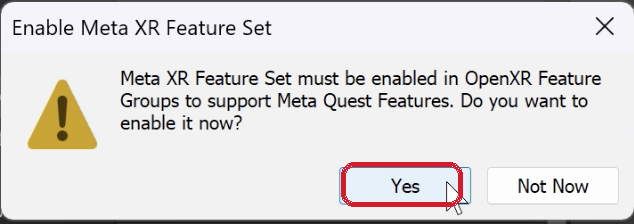

7
<h4 id="choose-your-telemetry-preference">Choose your telemetry preference</h4>
You'll then be asked about sharing edit-time telemetry with Meta. For privacy, we recommend clicking <b>Withhold</b>.

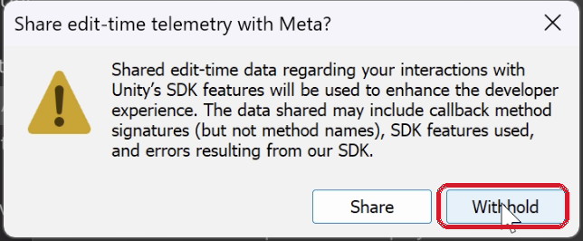

XR IMMERSIVE MEDIA LABPage 14

</section>
<section class="page" id="p15">

Unity 6000.3.23f1

<h2 id="project-the-meta-xr-sdk-cont-7" class="ptitle">Project &amp; the Meta XR SDK (cont.)</h2>

Step 11 (continued)

8
<h4 id="limit-additional-data-sharing">Limit additional data sharing</h4>
A final prompt asks about sharing additional data with Meta. For privacy, we recommend <b>Only share essential data</b>.

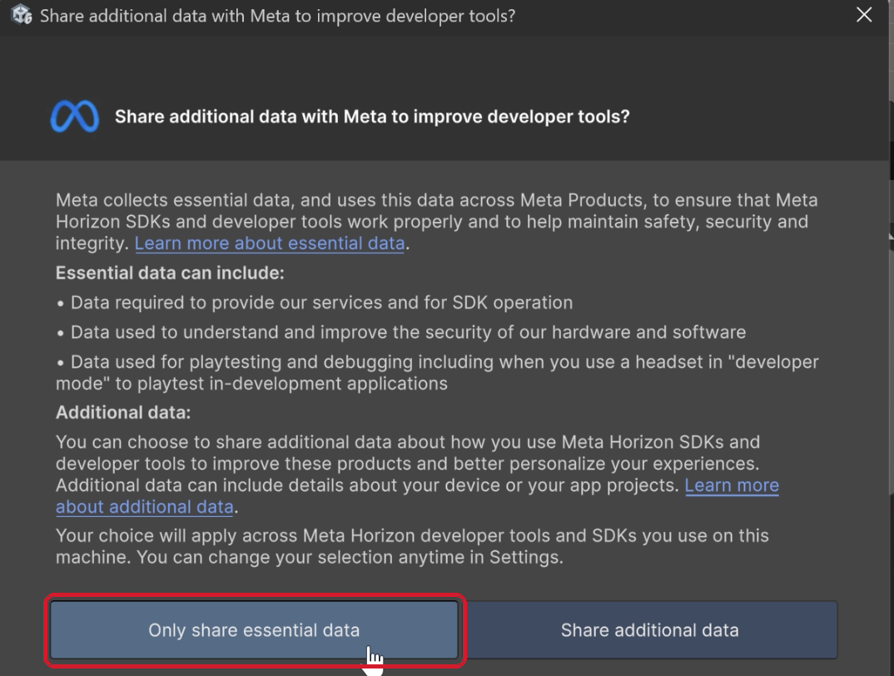

XR IMMERSIVE MEDIA LABPage 15

</section>
<section class="page" id="p16">

Unity 6000.3.23f1

<h2 id="project-the-meta-xr-sdk-cont-8" class="ptitle">Project &amp; the Meta XR SDK (cont.)</h2>

12
<h3 id="step-12">Finish the Meta XR SDK welcome</h3>
The first time the SDK loads, a <b>Welcome to Meta XR SDK</b> window opens. It's a quick, optional walkthrough - here's how to get through it.

1
<h4 id="get-started">Get started</h4>
Click <b>Get Started</b> to begin the short setup.

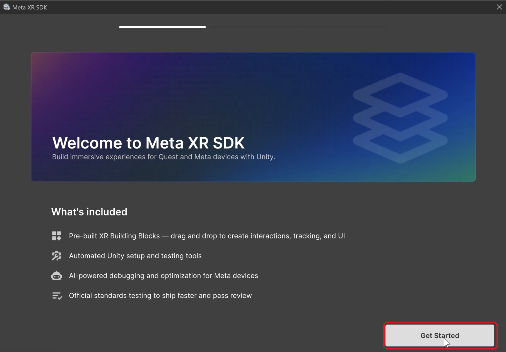

XR IMMERSIVE MEDIA LABPage 16

</section>
<section class="page" id="p17">

Unity 6000.3.23f1

<h2 id="project-the-meta-xr-sdk-cont-9" class="ptitle">Project &amp; the Meta XR SDK (cont.)</h2>

Step 12 (continued)

2
<h4 id="pick-your-experience-level">Pick your experience level</h4>
This just tailors the tips Meta shows you. For this guide, choose <b>Intermediate</b>.

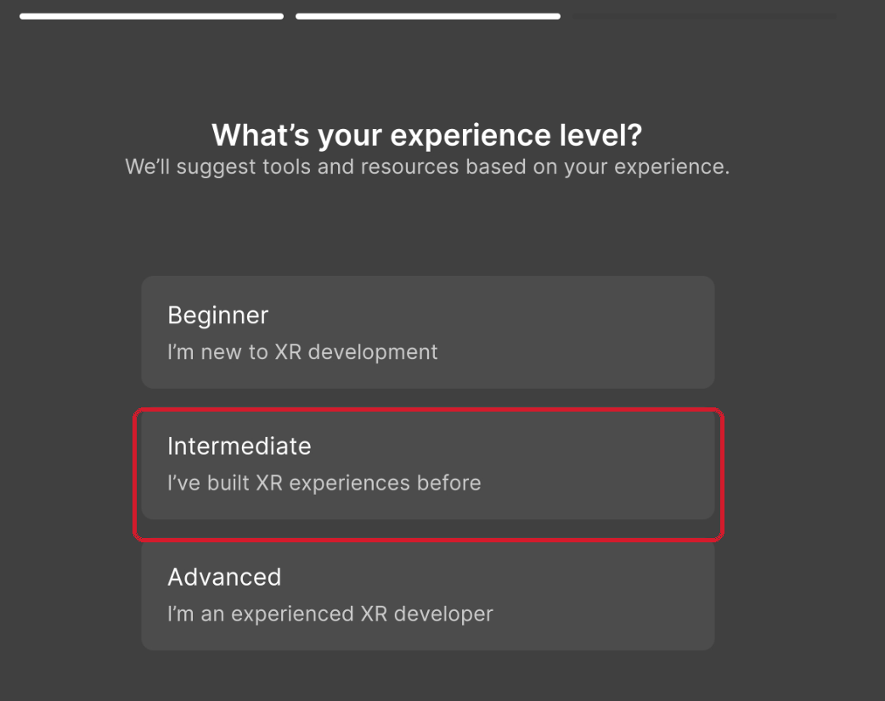

3
<h4 id="pick-a-role-then-finish">Pick a role, then finish</h4>
Again, this only personalizes suggestions. Choose <b>Other</b>, then click <b>Finish setup</b>.

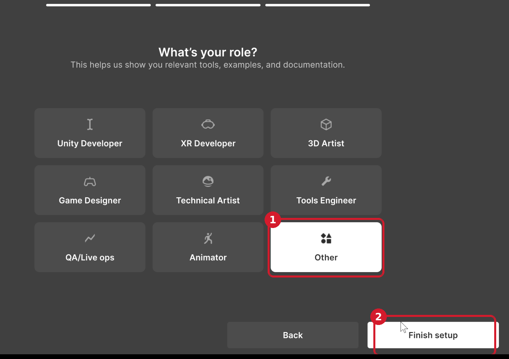

XR IMMERSIVE MEDIA LABPage 17

</section>
<section class="page" id="p18">

Unity 6000.3.23f1

<h2 id="project-the-meta-xr-sdk-cont-10" class="ptitle">Project &amp; the Meta XR SDK (cont.)</h2>

Step 12 (continued)

4
<h4 id="close-the-welcome-window">Close the welcome window</h4>
You land on the SDK dashboard with links to Building Blocks, samples and docs. For now, click the <b>X</b> in the top-right corner to close it.

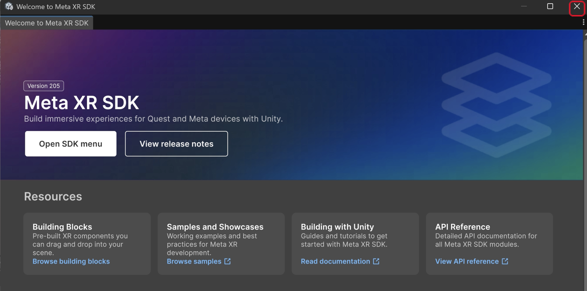

13
<h3 id="step-13">Confirm OpenXR is enabled</h3>
Enabling the feature set usually sets this up, but it's worth a quick check on <b>both</b> platform tabs. Open Edit &rarr; Project Settings &rarr; XR Plug-in Management.

1
<h4 id="check-the-pc-desktop-tab">Check the PC (Desktop) tab</h4>
On the desktop/monitor tab, make sure <b>Initialize XR on Startup</b> is on, and <b>OpenXR</b> + <b>Meta XR feature group</b> are checked. Editor Play mode uses these settings, so they matter for testing over Link.

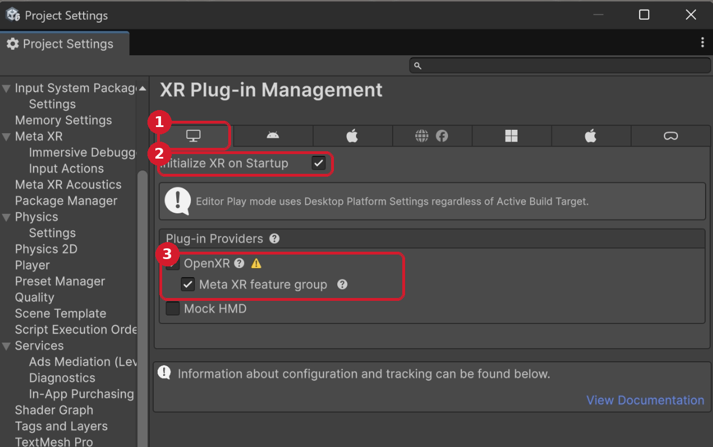

XR IMMERSIVE MEDIA LABPage 18

</section>
<section class="page" id="p19">

Unity 6000.3.23f1

<h2 id="project-the-meta-xr-sdk-cont-11" class="ptitle">Project &amp; the Meta XR SDK (cont.)</h2>

Step 13 (continued)

2
<h4 id="check-the-android-tab">Check the Android tab</h4>
Switch to the <b>Android</b> tab and confirm the same three: <b>Initialize XR on Startup</b>, <b>OpenXR</b>, and <b>Meta XR feature group</b>. This is what ships to the Quest.

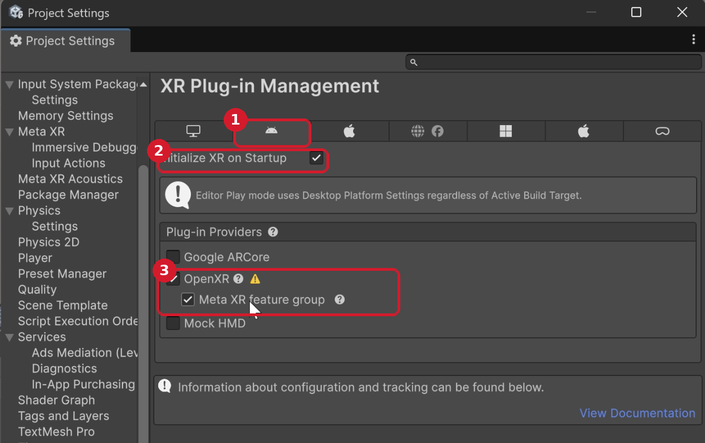

About the yellow warning

A yellow &#9888; next to OpenXR just means there are validation fixes to apply - the <b>Project Setup Tool</b> (Step 15) clears those.

14
<h3 id="step-14">What Building Blocks and the Setup Tool do</h3>
Instead of wiring passthrough, rigs, and interactions by hand, the Meta SDK gives you two shortcuts. The <b>Project Setup Tool</b> fixes all the project settings for you, and <b>Building Blocks</b> drop ready-made, pre-configured objects into your scene.

Project Setup Tool  &rarr; fixes settings (OpenXR, Vulkan, passthrough)
Building Blocks     &rarr; drops in rigs, passthrough, hands, grab

XR IMMERSIVE MEDIA LABPage 19

</section>
<section class="page" id="p20">

Unity 6000.3.23f1

<h2 id="configure-add-building-blocks" class="ptitle">Configure &amp; Add Building Blocks</h2>

15
<h3 id="step-15">Run the Project Setup Tool</h3>
The Setup Tool fixes your project settings for you - OpenXR, the Meta XR feature group, Vulkan, color/HDR and passthrough. Work through it on <b>both</b> platform tabs.

1
<h4 id="open-the-project-setup-tool">Open the Project setup tool</h4>
Open the <b>Meta XR SDK &#9662;</b> dropdown in the top toolbar - the same menu as Building Blocks - and choose <b>Project setup tool</b>.

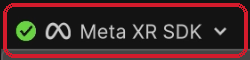

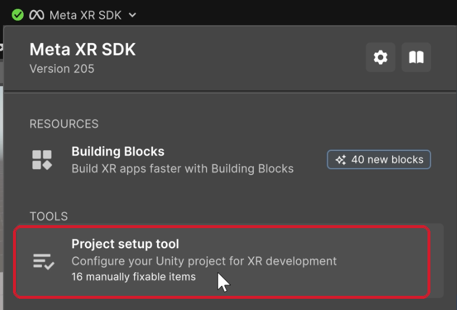

Choose <b>Project setup tool</b> from the menu.

XR IMMERSIVE MEDIA LABPage 20

</section>
<section class="page" id="p21">

Unity 6000.3.23f1

<h2 id="configure-add-building-blocks-cont" class="ptitle">Configure &amp; Add Building Blocks (cont.)</h2>

Step 15 (continued)

2
<h4 id="apply-all-on-the-android-tab">Apply All on the Android tab</h4>
On the <b>Android</b> tab (1), click <b>Apply All</b> (2) to apply the recommended fixes. Apply any Required items too.

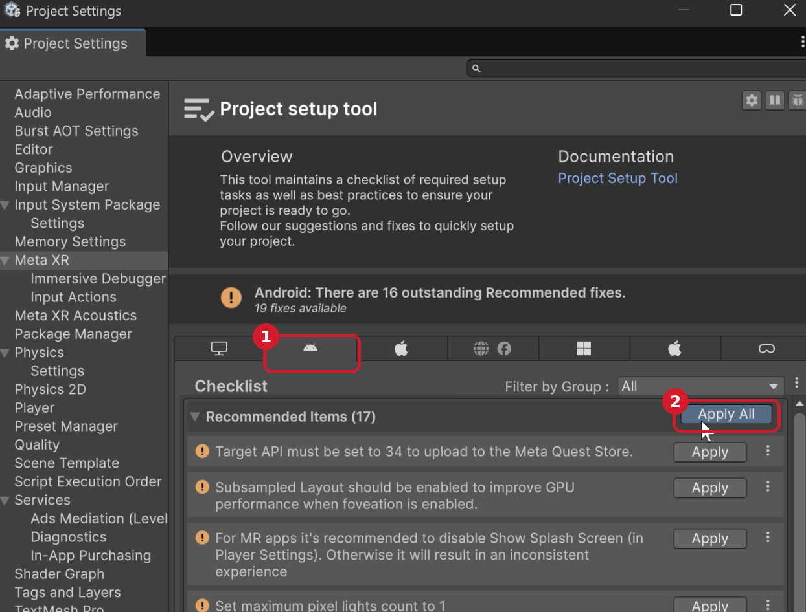

3
<h4 id="overwrite-the-androidmanifest">Overwrite the AndroidManifest</h4>
If an <b>Update AndroidManifest.xml</b> prompt appears, click <b>Overwrite</b>.

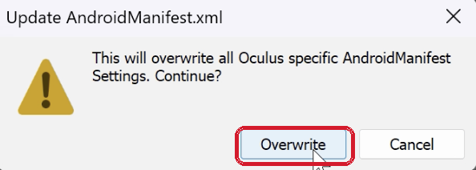

XR IMMERSIVE MEDIA LABPage 21

</section>
<section class="page" id="p22">

Unity 6000.3.23f1

<h2 id="configure-add-building-blocks-cont-2" class="ptitle">Configure &amp; Add Building Blocks (cont.)</h2>

Step 15 (continued)

4
<h4 id="apply-all-on-the-windows-tab">Apply All on the Windows tab</h4>
Switch to the <b>Windows</b> tab (1) and click <b>Apply All</b> (2) there too.

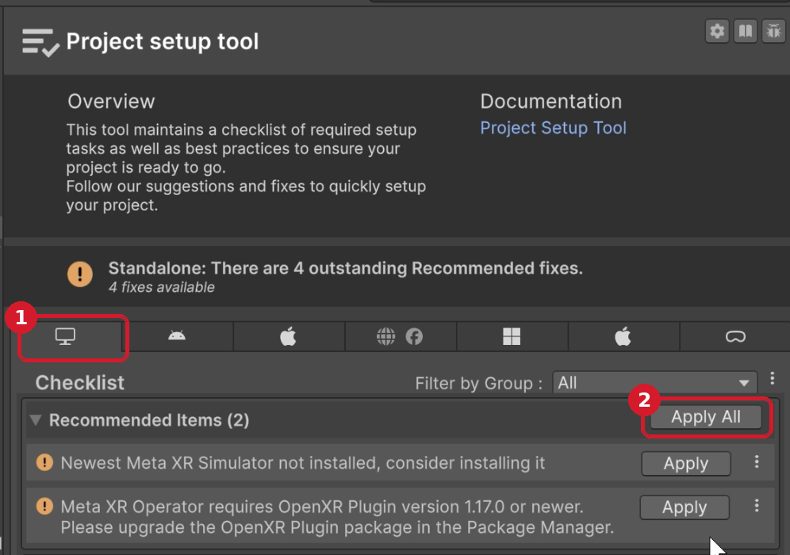

5
<h4 id="switch-the-graphics-api-and-restart">Switch the Graphics API and restart</h4>
On Windows it may switch the Graphics API and restart - possibly more than once. <b>Save first</b>, then click <b>Yes, Switch and Restart</b>.

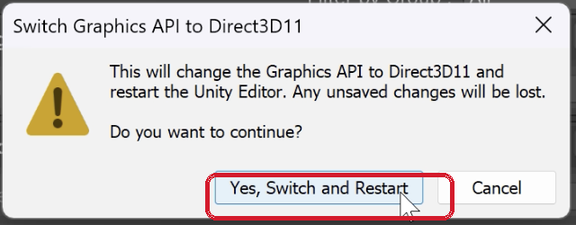

Meta XR Simulator (lab machines)

The Setup Tool may try to install the <b>Meta XR Simulator</b>, or show a Project Setup Tool Fix Available prompt to install it. The <b>XRIML</b> and <b>RY324</b> machines don't support it, so the install may fail with an error - you can safely <b>ignore</b> it.

XR IMMERSIVE MEDIA LABPage 22

</section>
<section class="page" id="p23">

Unity 6000.3.23f1

<h2 id="configure-add-building-blocks-cont-3" class="ptitle">Configure &amp; Add Building Blocks (cont.)</h2>

Step 15 (continued)

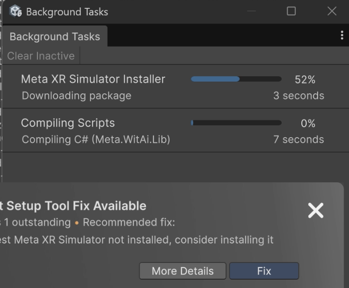

The Simulator install may fail on the lab machines - that error is safe to ignore.

16
<h3 id="step-16">Update the OpenXR Plugin</h3>
The Meta SDK needs a recent <b>OpenXR Plugin</b>. Open Window &rarr; Package Manager, select <b>OpenXR Plugin</b> under <b>In Project</b>, open the <b>Version History</b> tab, and click <b>Update</b> on the latest - this guide uses <b>1.18.0</b>.

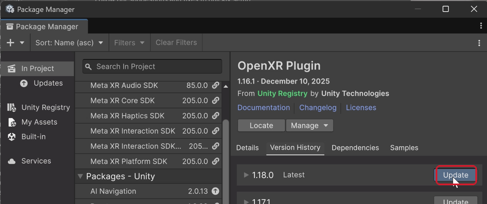

In <b>OpenXR Plugin &rarr; Version History</b>, click <b>Update</b> on the latest (1.18.0).

Clears the version warning

This resolves the <b>"Meta XR Operator requires OpenXR Plugin 1.17.0 or newer"</b> warning. You can switch to a different version anytime by clicking <b>Update</b> on that version.

XR IMMERSIVE MEDIA LABPage 23

</section>
<section class="page" id="p24">

Unity 6000.3.23f1

<h2 id="configure-add-building-blocks-cont-4" class="ptitle">Configure &amp; Add Building Blocks (cont.)</h2>

17
<h3 id="step-17">Open the Building Blocks window</h3>
Building Blocks live in the <b>Meta XR SDK &#9662;</b> dropdown - the same toolbar menu as the Project setup tool. Open it and choose <b>Building Blocks</b>.

The <b>Meta XR SDK</b> dropdown sits in the Editor's top toolbar.

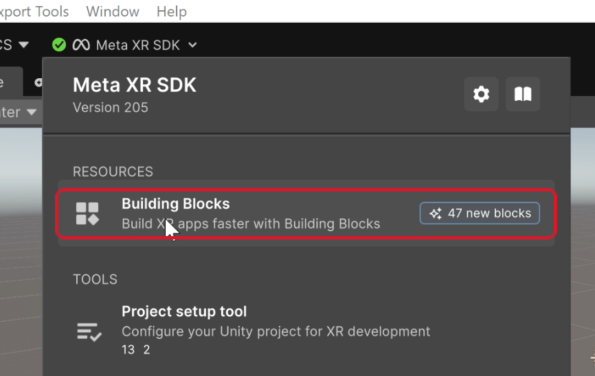

Choose <b>Building Blocks</b> from the menu.

XR IMMERSIVE MEDIA LABPage 24

</section>
<section class="page" id="p25">

Unity 6000.3.23f1

<h2 id="configure-add-building-blocks-cont-5" class="ptitle">Configure &amp; Add Building Blocks (cont.)</h2>

18
<h3 id="step-18">Add the Camera Rig and Passthrough</h3>
In the <b>Building Blocks</b> window you can search or filter by category, then add a block with the <b>add button</b> in its lower-right corner. Add <b>Camera Rig</b> first, then <b>Passthrough</b>.

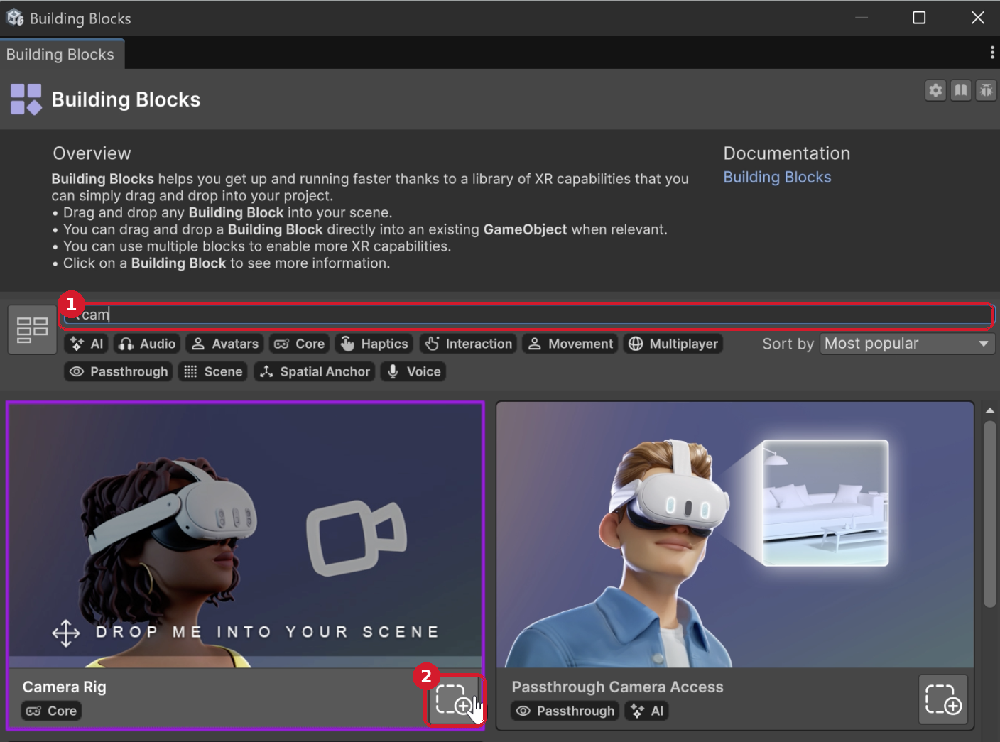

Search (1), then add <b>Camera Rig</b> with its add button (2). Pick plain <b>Camera Rig</b> - not Passthrough Camera Access.

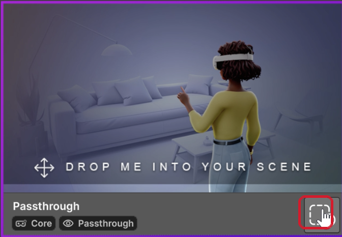

Add the <b>Passthrough</b> block the same way.

XR IMMERSIVE MEDIA LABPage 25

</section>
<section class="page" id="p26">

Unity 6000.3.23f1

<h2 id="configure-add-building-blocks-cont-6" class="ptitle">Configure &amp; Add Building Blocks (cont.)</h2>

19
<h3 id="step-19">Add controller and hand tracking</h3>
Back in the same <b>Building Blocks</b> window, add the <b>Controller Tracking</b> block, then add the <b>Real Hands</b> block for hand tracking. Each is added with its add button and wires itself into the Camera Rig automatically.

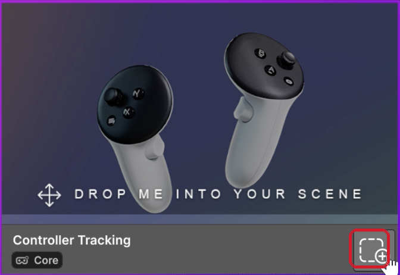

Add <b>Controller Tracking</b>.

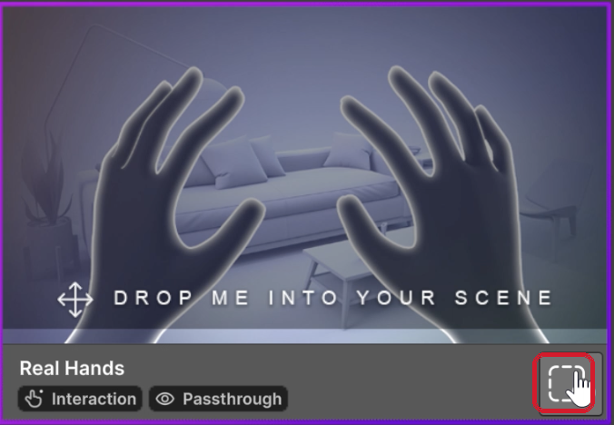

Add <b>Real Hands</b> for hand tracking.

XR IMMERSIVE MEDIA LABPage 26

</section>
<section class="page" id="p27">

Unity 6000.3.23f1

<h2 id="configure-add-building-blocks-cont-7" class="ptitle">Configure &amp; Add Building Blocks (cont.)</h2>

20
<h3 id="step-20">Add the grabbable cube</h3>
Add the <b>Grab Interaction</b> block - it drops a ready-made <b>Cube</b> that's already grabbable by hands and controllers. The block wires the collider, Rigidbody and grab interaction you'd otherwise add by hand.

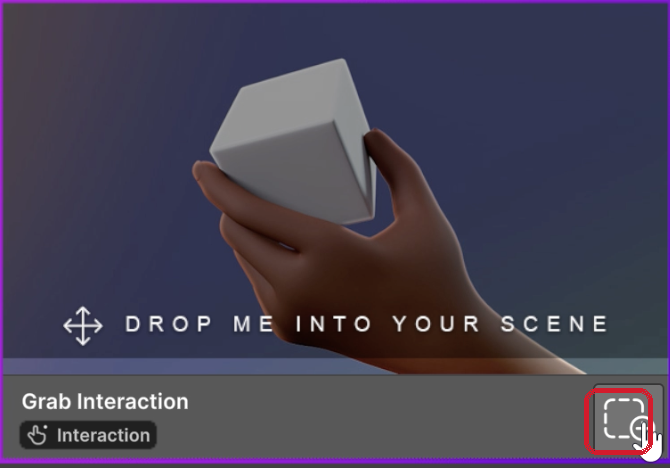

Add the <b>Grab Interaction</b> block with its add button.

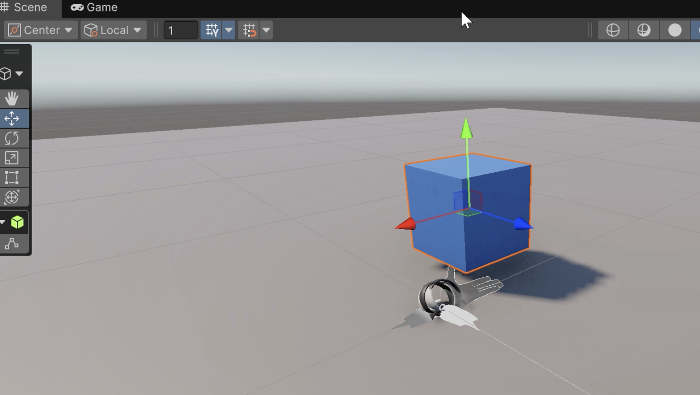

The block drops a blue <b>Cube</b> into the scene, ready to grab.

Resize and move the cube

The block's cube spawns small, at the origin. With it selected, make it larger and move it in front of you - <b>Position</b> around (0, 1, 0.5) - in the <b>Inspector</b>, or with the Scene-view <b>Move</b>/<b>Scale</b> tools (page 3).

XR IMMERSIVE MEDIA LABPage 27

</section>
<section class="page" id="p28">

Unity 6000.3.23f1

<h2 id="hierarchy-build-test" class="ptitle">Hierarchy, Build &amp; Test</h2>

21
<h3 id="step-21">Check your hierarchy</h3>
Before building, glance at the <b>Hierarchy</b> - it should look like this. The <b>Cube</b>, <b>Plane</b>, <b>Passthrough</b> and <b>Real Hands</b> sit at the top level; the <b>Camera Rig</b> holds the eye/hand anchors, controller tracking and interaction.

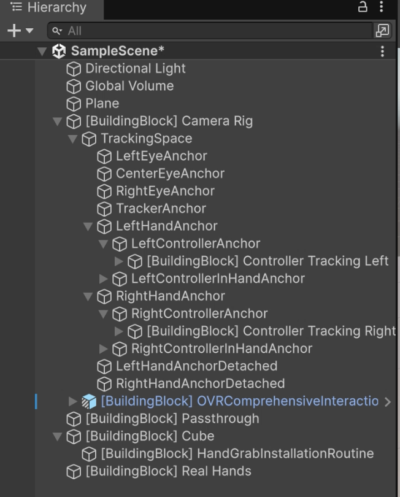

The expected Hierarchy after adding every block.

XR IMMERSIVE MEDIA LABPage 28

</section>
<section class="page" id="p29">

Unity 6000.3.23f1

<h2 id="hierarchy-build-test-cont" class="ptitle">Hierarchy, Build &amp; Test (cont.)</h2>

22
<h3 id="step-22">Build and run</h3>
Connect your <b>Meta Quest 3</b> to the PC and pop the headset on. The first time you do this, you'll need to approve a couple of prompts on the Quest before it shows up in Unity as a build device.

1
<h4 id="allow-usb-debugging">Allow USB debugging</h4>
        
When the <b>Allow USB debugging?</b> prompt appears, pick <b>Always allow from this computer</b> so you're not asked again on every build.

        
<svg xmlns="http://www.w3.org/2000/svg" viewBox="0 0 820 1030" font-family="'DejaVu Sans', Arial, sans-serif"> <rect x="6" y="6" width="808" height="1018" rx="46" fill="#2b2b2d"></rect> <g transform="translate(410,92)">  <path d="M0,-20 L72,104 L-72,104 Z" fill="#ffffff" stroke="#ffffff" stroke-width="16" stroke-linejoin="round"></path>  <rect x="-8" y="26" width="16" height="46" rx="8" fill="#2b2b2d"></rect>  <circle cx="0" cy="90" r="9" fill="#2b2b2d"></circle> </g> <text x="410" y="270" text-anchor="middle" font-size="46" font-weight="700" fill="#ffffff">Allow USB debugging?</text> <g fill="#d2d2d5" font-size="27" text-anchor="middle">  <text x="410" y="338">Your device is not secure in developer mode</text>  <text x="410" y="376">and may be vulnerable to malicious software</text>  <text x="410" y="414">installed using ADB.</text>  <text x="410" y="488">The computer's RSA key fingerprint is:</text>  <text x="410" y="526">C5:83:93:8E:D0:D3:15:1F:31:4B:FA:A6:2C:F9</text>  <text x="410" y="564">:0C:43</text> </g> <rect x="62" y="636" width="696" height="82" rx="41" fill="#e9e9ea"></rect> <text x="410" y="688" text-anchor="middle" font-size="30" fill="#33343a">Allow</text> <rect x="62" y="736" width="696" height="82" rx="41" fill="#454547"></rect> <text x="410" y="788" text-anchor="middle" font-size="30" fill="#f0f0f2">Cancel</text> <rect x="62" y="836" width="696" height="82" rx="41" fill="#454547"></rect> <text x="410" y="888" text-anchor="middle" font-size="30" font-weight="700" fill="#f0f0f2">Always allow from this computer</text> <rect x="50" y="826" width="720" height="102" rx="51" fill="none" stroke="#de1a2c" stroke-width="7"></rect></svg>

        
Choose <b>Always allow from this computer</b> on the USB-debugging prompt.

2
<h4 id="allow-file-access-in-the-headset">Allow file access in the headset</h4>
        
When the <b>USB Detected</b> notification pops up, tap it to let the connected device access files.

        
<svg xmlns="http://www.w3.org/2000/svg" viewBox="0 0 1000 236" font-family="'DejaVu Sans', Arial, sans-serif"> <rect x="6" y="6" width="988" height="224" rx="46" fill="#e9eaed"></rect> <circle cx="44" cy="118" r="11" fill="#2b7bff"></circle> <!-- app icon tile with a VR-headset glyph --> <rect x="86" y="50" width="136" height="136" rx="34" fill="#f6f6f8"></rect> <g fill="#3d3e44">  <rect x="112" y="98" width="84" height="44" rx="18"></rect> </g> <circle cx="134" cy="120" r="12" fill="#f6f6f8"></circle> <circle cx="174" cy="120" r="12" fill="#f6f6f8"></circle> <!-- title + timestamp --> <text x="252" y="106" font-size="46" font-weight="700" fill="#1f2024">USB Detected<tspan font-size="38" font-weight="400" fill="#8a8b91">  · 1m</tspan></text> <!-- body --> <g fill="#56575d" font-size="31">  <text x="252" y="156">Click on this notification to allow the</text>  <text x="252" y="196">connected device to access files.</text> </g> <!-- red highlight --> <rect x="-1" y="-1" width="1002" height="238" rx="52" fill="none" stroke="#de1a2c" stroke-width="8"></rect></svg>

        
In the headset, select the <b>USB Detected</b> notification.

        
If it has already disappeared, open <b>Notifications</b> (the bell icon in the bottom menu) and select it there.

        
<svg xmlns="http://www.w3.org/2000/svg" viewBox="0 0 1040 220" font-family="'DejaVu Sans', Arial, sans-serif"> <defs>  <linearGradient id="bell" x1="0.15" y1="0" x2="0.7" y2="1">   <stop offset="0" stop-color="#8a3ff0"></stop><stop offset="0.5" stop-color="#e0459e"></stop><stop offset="1" stop-color="#3a8dff"></stop>  </linearGradient>  <filter id="sh" x="-40%" y="-40%" width="180%" height="180%">   <feDropShadow dx="0" dy="2" stdDeviation="6" flood-color="#000000" flood-opacity="0.22"></feDropShadow>  </filter> </defs> <!-- light grey backdrop --> <rect x="8" y="56" width="1024" height="108" rx="26" fill="#dcdde1" stroke="#c7c8cd" stroke-width="2"></rect> <!-- avatar --> <circle cx="100" cy="110" r="40" fill="#c2c7ce"></circle> <circle cx="100" cy="100" r="14" fill="#6b7280"></circle> <path d="M74,144 a26,26 0 0 1 52,0 Z" fill="#6b7280"></path> <!-- app tile: blue with isometric room --> <rect x="176" y="71" width="78" height="78" rx="20" fill="#3a9fe6"></rect> <polygon points="215,140 242,124 215,108 188,124" fill="#e9ddc6"></polygon> <polygon points="188,124 215,108 215,82 188,98" fill="#f5efe2"></polygon> <polygon points="215,108 242,124 242,98 215,82" fill="#ddd0ba"></polygon> <rect x="221" y="99" width="14" height="15" fill="#a9d3f0" transform="skewY(-14)" transform-origin="221 99"></rect> <!-- divider --> <line x1="298" y1="82" x2="298" y2="138" stroke="#a9aab0" stroke-width="3"></line> <!-- apps grid 3x3 --> <g fill="#3c3d42">  <rect x="360" y="90" width="12" height="12" rx="3"></rect><rect x="379" y="90" width="12" height="12" rx="3"></rect><rect x="398" y="90" width="12" height="12" rx="3"></rect>  <rect x="360" y="104" width="12" height="12" rx="3"></rect><rect x="379" y="104" width="12" height="12" rx="3"></rect><rect x="398" y="104" width="12" height="12" rx="3"></rect>  <rect x="360" y="118" width="12" height="12" rx="3"></rect><rect x="379" y="118" width="12" height="12" rx="3"></rect><rect x="398" y="118" width="12" height="12" rx="3"></rect> </g> <!-- people --> <g fill="#3c3d42">  <circle cx="494" cy="97" r="12"></circle><path d="M472,138 a22,22 0 0 1 44,0 Z"></path>  <circle cx="523" cy="99" r="10"></circle><path d="M505,136 a18,18 0 0 1 36,0 Z"></path> </g> <!-- divider --> <line x1="600" y1="82" x2="600" y2="138" stroke="#a9aab0" stroke-width="3"></line> <!-- sliders --> <g stroke="#3c3d42" stroke-width="4" stroke-linecap="round">  <line x1="672" y1="94" x2="732" y2="94"></line><line x1="672" y1="110" x2="732" y2="110"></line><line x1="672" y1="126" x2="732" y2="126"></line> </g> <g fill="#dcdde1" stroke="#3c3d42" stroke-width="4">  <circle cx="716" cy="94" r="6"></circle><circle cx="688" cy="110" r="6"></circle><circle cx="720" cy="126" r="6"></circle> </g> <!-- tooltip --> <rect x="802" y="8" width="176" height="40" rx="12" fill="#1c1d20"></rect> <text x="890" y="35" text-anchor="middle" font-size="22" font-weight="700" fill="#ffffff">Notifications</text> <!-- bell (highlighted white circle, gradient bell) --> <circle cx="890" cy="110" r="52" fill="#ffffff" filter="url(#sh)"></circle> <g fill="url(#bell)">  <path d="M890,84 c-16,0 -27,12 -27,28 c0,19 -9,23 -9,29 l72,0 c0,-6 -9,-10 -9,-29 c0,-16 -11,-28 -27,-28 Z"></path>  <rect x="884" y="76" width="12" height="10" rx="5"></rect>  <path d="M879,141 a11,10 0 0 0 22,0 Z"></path> </g> <!-- red highlight --> <rect x="832" y="52" width="116" height="116" rx="58" fill="none" stroke="#de1a2c" stroke-width="7"></rect></svg>

        
Open <b>Notifications</b> from the bottom menu.

XR IMMERSIVE MEDIA LABPage 29

</section>
<section class="page" id="p30">

Unity 6000.3.23f1

<h2 id="hierarchy-build-test-cont-2" class="ptitle">Hierarchy, Build &amp; Test (cont.)</h2>

Step 22 (continued)

3
<h4 id="select-your-headset-and-build">Select your headset and build</h4>
        
Back in File → Build Profiles, confirm <b>Android</b> is selected. Open the <b>Run Device</b> dropdown and pick your Quest - it'll only show up once you've approved the prompts above - then hit Build And Run. Unity takes it from there, building and installing the app onto the headset.

        
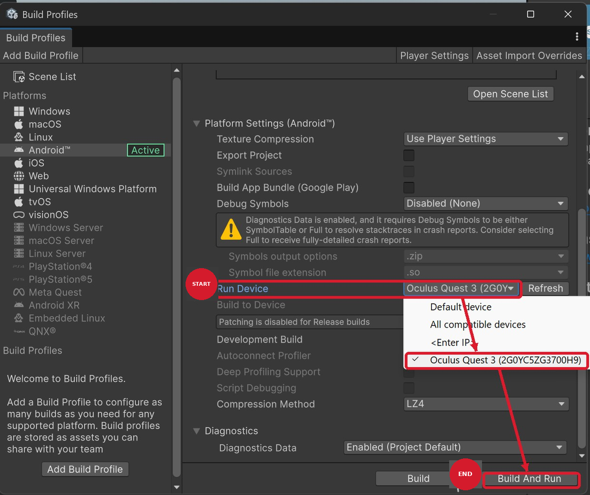

        
Pick your Quest in the <b>Run Device</b> dropdown, then <b>Build And Run</b>.

23
<h3 id="step-23">Or press Play to run over Horizon Link</h3>
When you're iterating, you don't have to build every time - you can run the scene straight from the editor over <b>Meta Horizon Link</b>. It's a live play-mode simulation rather than a full <b>Build and Run</b>, and it uses the Windows-side OpenXR runtime you set up earlier (Step 13).

First, enable Link in the headset:

XR IMMERSIVE MEDIA LABPage 30

</section>
<section class="page" id="p31">

Unity 6000.3.23f1

<h2 id="hierarchy-build-test-cont-3" class="ptitle">Hierarchy, Build &amp; Test (cont.)</h2>

Step 23 (continued)

<svg viewBox="0 0 600 432" xmlns="http://www.w3.org/2000/svg" font-family="Lato,Helvetica,Arial,sans-serif" xmlns:c2pa="http://c2pa.org/manifest"><metadata><c2pa:manifest>AAAWgmp1bWIAAAAeanVtZGMycGEAEQAQgAAAqgA4m3EDYzJwYQAAABZcanVtYgAAAEdqdW1kYzJtYQARABCAAACqADibcQN1cm46YzJwYTphMzNkNzUzYi1hMDIyLTQ4ZWMtYjg3Zi04MGY1YWFmZGM5MjQAAAADl2p1bWIAAAApanVtZGMyYXMAEQAQgAAAqgA4m3EDYzJwYS5hc3NlcnRpb25zAAAAALxqdW1iAAAARGp1bWRjYm9yABEAEIAAAKoAOJtxE2MycGEuaW5ncmVkaWVudC52MwAAAAAYYzJzaBRIhDaap/Ww8cwAzbF0mOYAAABwY2JvcqNpZGM6Zm9ybWF0bWltYWdlL3N2Zyt4bWxqaW5zdGFuY2VJRHgseG1wOmlpZDo3NDRhOTMxYi1hZTk2LTRmYWUtOGRlNS00ZTgwNTZjNGQwZjJscmVsYXRpb25zaGlwaHBhcmVudE9mAAAB4mp1bWIAAABBanVtZGNib3IAEQAQgAAAqgA4m3ETYzJwYS5hY3Rpb25zLnYyAAAAABhjMnNo7cwuOz8s9t3IdcJua//v7gAAAZljYm9yomdhY3Rpb25zgqJmYWN0aW9ua2MycGEub3BlbmVkanBhcmFtZXRlcnOha2luZ3JlZGllbnRzgaJjdXJseC1zZWxmI2p1bWJmPWMycGEuYXNzZXJ0aW9ucy9jMnBhLmluZ3JlZGllbnQudjNkaGFzaFggQpMGvMyLXFW59c5pVK3XKdyzvK74MfnNnU50TRPousykZmFjdGlvbngdY29tLmFudGhyb3BpYy5jbGF1ZGUucHJvdmlkZWRqcGFyYW1ldGVyc6F4H2NvbS5hbnRocm9waWMub3JpZ2luLWNvbmZpZGVuY2VndW5rbm93bmtkZXNjcmlwdGlvbnhmQ2xhdWRlIHByb3ZpZGVkIHRoaXMgZmlsZSBhdCB0aGUgcmVxdWVzdCBvZiBhIHVzZXIgYW5kIG1heSBoYXZlIGNyZWF0ZWQgb3IgbW9kaWZpZWQgdGhlIGZpbGUgY29udGVudHMubXNvZnR3YXJlQWdlbnShZG5hbWVmQ2xhdWRlcmFsbEFjdGlvbnNJbmNsdWRlZPUAAADIanVtYgAAAEBqdW1kY2JvcgARABCAAACqADibcRNjMnBhLmhhc2guZGF0YQAAAAAYYzJzaO/yB90Ow95ZolV85jlerJgAAACAY2JvcqVjYWxnZnNoYTI1NmNwYWRNAAAAAAAAAAAAAAAAAGRoYXNoWCC/A8Wz1nOH7SoE0Db9jmLJRqtPFMSAuhnQTKuaOjncTmRuYW1lbmp1bWJmIG1hbmlmZXN0amV4Y2x1c2lvbnOBomVzdGFydBirZmxlbmd0aBkeBAAAAj5qdW1iAAAAJ2p1bWRjMmNsABEAEIAAAKoAOJtxA2MycGEuY2xhaW0udjIAAAACD2Nib3KlY2FsZ2ZzaGEyNTZpc2lnbmF0dXJleE1zZWxmI2p1bWJmPS9jMnBhL3VybjpjMnBhOmEzM2Q3NTNiLWEwMjItNDhlYy1iODdmLTgwZjVhYWZkYzkyNC9jMnBhLnNpZ25hdHVyZWppbnN0YW5jZUlEeCx4bXA6aWlkOjM1ZjczNzU4LTVlNTAtNDIzMi1iZGY5LTVjNzI0ZTcwMGI4OXJjcmVhdGVkX2Fzc2VydGlvbnODomN1cmx4LXNlbGYjanVtYmY9YzJwYS5hc3NlcnRpb25zL2MycGEuaW5ncmVkaWVudC52M2RoYXNoWCBCkwa8zItcVbn1zmlUrdcp3LO8rvgx+c2dTnRNE+i6zKJjdXJseCpzZWxmI2p1bWJmPWMycGEuYXNzZXJ0aW9ucy9jMnBhLmFjdGlvbnMudjJkaGFzaFgg5GsFiFYBdyHutQbYzntQyBuGVqgBYgA6gOpwQs3e03KiY3VybHgpc2VsZiNqdW1iZj1jMnBhLmFzc2VydGlvbnMvYzJwYS5oYXNoLmRhdGFkaGFzaFggRKn5sVwS/IjnaVWmWBAqcCXzmrZFzoF4cOfmDAHtntJ0Y2xhaW1fZ2VuZXJhdG9yX2luZm+jZG5hbWVvQW50aHJvcGljIEZpbGVzZ3ZlcnNpb25lMS4wLjBrc3BlY1ZlcnNpb25lMi40LjAAABA4anVtYgAAAChqdW1kYzJjcwARABCAAACqADibcQNjMnBhLnNpZ25hdHVyZQAAABAIY2JvctKEWQISogEmGCFZAgowggIGMIIBjaADAgECAhRA5aAK7sI50L64g/oGQgU9Z1UTADAKBggqhkjOPQQDAzBJMRcwFQYDVQQKEw5BbnRocm9waWMsIFBCQzEuMCwGA1UEAxMlQW50aHJvcGljIENvbnRlbnQgQ3JlZGVudGlhbHMgUm9vdCBDQTAeFw0yNjA4MDcxODQzNTZaFw0yODA4MDYxOTQzNTZaMEQxFzAVBgNVBAoTDkFudGhyb3BpYywgUEJDMSkwJwYDVQQDEyBBbnRocm9waWMgQ2xhdWRlIENvbnRlbnQgU2lnbmluZzBZMBMGByqGSM49AgEGCCqGSM49AwEHA0IABJh6CmvLUBgFFNU0vUKlOVtE6djd17L5SuwX0LemFisBM3dkd/3cyjxFA3Qo5S46fX0/ihY0VZ7mfb9KF703t5OjWDBWMA4GA1UdDwEB/wQEAwIHgDAVBgNVHSUEDjAMBgorBgEEAYPoXgIBMAwGA1UdEwEB/wQCMAAwHwYDVR0jBBgwFoAUzlHiBIFOZFsj+OPEz5o+nMHXXMIwCgYIKoZIzj0EAwMDZwAwZAIwMXMdFJ4BetLLVY7ORuE9noqbbAZOZn/aArXyTwFAZfKrPzxF2vPoJNf1+UCdg1XGAjBwX1zd9WGqYkqmL5SFqw1QySjr1zJfpJM9+1rdDwSPLMOPOjKuiXjoU/pUUeG9RwmhY3BhZFkNngAAAAAAAAAAAAAAAAAAAAAAAAAAAAAAAAAAAAAAAAAAAAAAAAAAAAAAAAAAAAAAAAAAAAAAAAAAAAAAAAAAAAAAAAAAAAAAAAAAAAAAAAAAAAAAAAAAAAAAAAAAAAAAAAAAAAAAAAAAAAAAAAAAAAAAAAAAAAAAAAAAAAAAAAAAAAAAAAAAAAAAAAAAAAAAAAAAAAAAAAAAAAAAAAAAAAAAAAAAAAAAAAAAAAAAAAAAAAAAAAAAAAAAAAAAAAAAAAAAAAAAAAAAAAAAAAAAAAAAAAAAAAAAAAAAAAAAAAAAAAAAAAAAAAAAAAAAAAAAAAAAAAAAAAAAAAAAAAAAAAAAAAAAAAAAAAAAAAAAAAAAAAAAAAAAAAAAAAAAAAAAAAAAAAAAAAAAAAAAAAAAAAAAAAAAAAAAAAAAAAAAAAAAAAAAAAAAAAAAAAAAAAAAAAAAAAAAAAAAAAAAAAAAAAAAAAAAAAAAAAAAAAAAAAAAAAAAAAAAAAAAAAAAAAAAAAAAAAAAAAAAAAAAAAAAAAAAAAAAAAAAAAAAAAAAAAAAAAAAAAAAAAAAAAAAAAAAAAAAAAAAAAAAAAAAAAAAAAAAAAAAAAAAAAAAAAAAAAAAAAAAAAAAAAAAAAAAAAAAAAAAAAAAAAAAAAAAAAAAAAAAAAAAAAAAAAAAAAAAAAAAAAAAAAAAAAAAAAAAAAAAAAAAAAAAAAAAAAAAAAAAAAAAAAAAAAAAAAAAAAAAAAAAAAAAAAAAAAAAAAAAAAAAAAAAAAAAAAAAAAAAAAAAAAAAAAAAAAAAAAAAAAAAAAAAAAAAAAAAAAAAAAAAAAAAAAAAAAAAAAAAAAAAAAAAAAAAAAAAAAAAAAAAAAAAAAAAAAAAAAAAAAAAAAAAAAAAAAAAAAAAAAAAAAAAAAAAAAAAAAAAAAAAAAAAAAAAAAAAAAAAAAAAAAAAAAAAAAAAAAAAAAAAAAAAAAAAAAAAAAAAAAAAAAAAAAAAAAAAAAAAAAAAAAAAAAAAAAAAAAAAAAAAAAAAAAAAAAAAAAAAAAAAAAAAAAAAAAAAAAAAAAAAAAAAAAAAAAAAAAAAAAAAAAAAAAAAAAAAAAAAAAAAAAAAAAAAAAAAAAAAAAAAAAAAAAAAAAAAAAAAAAAAAAAAAAAAAAAAAAAAAAAAAAAAAAAAAAAAAAAAAAAAAAAAAAAAAAAAAAAAAAAAAAAAAAAAAAAAAAAAAAAAAAAAAAAAAAAAAAAAAAAAAAAAAAAAAAAAAAAAAAAAAAAAAAAAAAAAAAAAAAAAAAAAAAAAAAAAAAAAAAAAAAAAAAAAAAAAAAAAAAAAAAAAAAAAAAAAAAAAAAAAAAAAAAAAAAAAAAAAAAAAAAAAAAAAAAAAAAAAAAAAAAAAAAAAAAAAAAAAAAAAAAAAAAAAAAAAAAAAAAAAAAAAAAAAAAAAAAAAAAAAAAAAAAAAAAAAAAAAAAAAAAAAAAAAAAAAAAAAAAAAAAAAAAAAAAAAAAAAAAAAAAAAAAAAAAAAAAAAAAAAAAAAAAAAAAAAAAAAAAAAAAAAAAAAAAAAAAAAAAAAAAAAAAAAAAAAAAAAAAAAAAAAAAAAAAAAAAAAAAAAAAAAAAAAAAAAAAAAAAAAAAAAAAAAAAAAAAAAAAAAAAAAAAAAAAAAAAAAAAAAAAAAAAAAAAAAAAAAAAAAAAAAAAAAAAAAAAAAAAAAAAAAAAAAAAAAAAAAAAAAAAAAAAAAAAAAAAAAAAAAAAAAAAAAAAAAAAAAAAAAAAAAAAAAAAAAAAAAAAAAAAAAAAAAAAAAAAAAAAAAAAAAAAAAAAAAAAAAAAAAAAAAAAAAAAAAAAAAAAAAAAAAAAAAAAAAAAAAAAAAAAAAAAAAAAAAAAAAAAAAAAAAAAAAAAAAAAAAAAAAAAAAAAAAAAAAAAAAAAAAAAAAAAAAAAAAAAAAAAAAAAAAAAAAAAAAAAAAAAAAAAAAAAAAAAAAAAAAAAAAAAAAAAAAAAAAAAAAAAAAAAAAAAAAAAAAAAAAAAAAAAAAAAAAAAAAAAAAAAAAAAAAAAAAAAAAAAAAAAAAAAAAAAAAAAAAAAAAAAAAAAAAAAAAAAAAAAAAAAAAAAAAAAAAAAAAAAAAAAAAAAAAAAAAAAAAAAAAAAAAAAAAAAAAAAAAAAAAAAAAAAAAAAAAAAAAAAAAAAAAAAAAAAAAAAAAAAAAAAAAAAAAAAAAAAAAAAAAAAAAAAAAAAAAAAAAAAAAAAAAAAAAAAAAAAAAAAAAAAAAAAAAAAAAAAAAAAAAAAAAAAAAAAAAAAAAAAAAAAAAAAAAAAAAAAAAAAAAAAAAAAAAAAAAAAAAAAAAAAAAAAAAAAAAAAAAAAAAAAAAAAAAAAAAAAAAAAAAAAAAAAAAAAAAAAAAAAAAAAAAAAAAAAAAAAAAAAAAAAAAAAAAAAAAAAAAAAAAAAAAAAAAAAAAAAAAAAAAAAAAAAAAAAAAAAAAAAAAAAAAAAAAAAAAAAAAAAAAAAAAAAAAAAAAAAAAAAAAAAAAAAAAAAAAAAAAAAAAAAAAAAAAAAAAAAAAAAAAAAAAAAAAAAAAAAAAAAAAAAAAAAAAAAAAAAAAAAAAAAAAAAAAAAAAAAAAAAAAAAAAAAAAAAAAAAAAAAAAAAAAAAAAAAAAAAAAAAAAAAAAAAAAAAAAAAAAAAAAAAAAAAAAAAAAAAAAAAAAAAAAAAAAAAAAAAAAAAAAAAAAAAAAAAAAAAAAAAAAAAAAAAAAAAAAAAAAAAAAAAAAAAAAAAAAAAAAAAAAAAAAAAAAAAAAAAAAAAAAAAAAAAAAAAAAAAAAAAAAAAAAAAAAAAAAAAAAAAAAAAAAAAAAAAAAAAAAAAAAAAAAAAAAAAAAAAAAAAAAAAAAAAAAAAAAAAAAAAAAAAAAAAAAAAAAAAAAAAAAAAAAAAAAAAAAAAAAAAAAAAAAAAAAAAAAAAAAAAAAAAAAAAAAAAAAAAAAAAAAAAAAAAAAAAAAAAAAAAAAAAAAAAAAAAAAAAAAAAAAAAAAAAAAAAAAAAAAAAAAAAAAAAAAAAAAAAAAAAAAAAAAAAAAAAAAAAAAAAAAAAAAAAAAAAAAAAAAAAAAAAAAAAAAAAAAAAAAAAAAAAAAAAAAAAAAAAAAAAAAAAAAAAAAAAAAAAAAAAAAAAAAAAAAAAAAAAAAAAAAAAAAAAAAAAAAAAAAAAAAAAAAAAAAAAAAAAAAAAAAAAAAAAAAAAAAAAAAAAAAAAAAAAAAAAAAAAAAAAAAAAAAAAAAAAAAAAAAAAAAAAAAAAAAAAAAAAAAAAAAAAAAAAAAAAAAAAAAAAAAAAAAAAAAAAAAAAAAAAAAAAAAAAAAAAAAAAAAAAAAAAAAAAAAAAAAAAAAAAAAAAAAAAAAAAAAAAAAAAAAAAAAAAAAAAAAAAAAAAAAAAAAAAAAAAAAAAAAAAAAAAAAAAAAAAAAAAAAAAAAAAAAAAAAAAAAAAAAAAAAAAAAAAAAAAAAAAAAAAAAAAAAAAAAAAAAAAAAAAAAAAAAAAAAAAAAAAAAAAAAAAAAAAAAAAAAAAAAAAAAAAAAAAAAAAAAAAAAAAAAAAAAAAAAAAAAAAAAAAAAAAAAAAAAAAAAAAAAAAAAAAAAAAAAAAAAAAAAAAAAAAAAAAAAAAAAAAAAAAAAAAAAAAAAAAAAAAAAAAAAAAAAAAAAAAAAAAAAAAAAAAAAAAAAAAAAAAAAAAAAAAAAAAAAAAAAAAAAAAAAAAAAAAAAAAAAAAAAAAAAAAAAAAAAAAAAAAAAAAAAAAAAAAAAAAAAAAAAAAAAAAAAAAAAAAAAAAAAAAAAAAAAAAAAAAAAAAAAAAAAAAAAAAAAAAAAAAAAAAAAAAAAAAAAAAAAAAAAAAAAAAAAAAAAAAAAAAAAAAAAAAAAAAAAAAAAAAAAAAAAAAAAAAAAAAAAAAAAAAAAAAAAAAAAAAAAAAAAAAAAAAAAAAAAAAAAAAAAAAAAAAAAAAAAAAAAAAAAAAAAAAAAAAAAAAAAAAAAAAAAAAAAAAAAAAAAAAAAAAAAAAAAAAAAAAAAAAAAAAAAAAAAAAAAAAAAAAAAAAAAAAAAAAAAAAAAAAAAAAAAAAAAAAAAAAAAAAAAAAAAAAAAAAAAAAAAAAAAAAAAAAAAAAAAAAAAAAAAAAAAAAAAAAAAAAAAAAAAAAAAAAAAAAAAAAAAAAAAAAAAAAAAAAAAAAAAAAAAAAAAAAAAAAAAAAAAAAAAAAAAAAAAAAAAAAAAAAAAAAAAAAAAAAAAAAAAAAAAAAAAAAAAAAAAAAAAAAAAAAAAAAAAAAAAAAAAAAAAAAAAAAAAAAAAAAAAAAAAAAAAAAAAAAAAAAAAAAAAAAAAAAAAAAAAAAAAAAAAAAAAAAAAAAAAAAAAAAAAAAAAAAAAAAAAAAAAAAAAAAAAAAAAAAAAAAAAAAAAAAAAAAAAAAAAAAAAAAAAAAAAAAAAAAAAAAAAAAAAAAAAAAAAAAAAAAAAAAAAAAAAAAAAAAAAAAAAAAAAAAAAAAAAAAAAAAAAAAAAAAAAAAAAAAAAAAAAAAAAAAAAAAAAAAAAAAAAAAAAAAAAAAAAAAAAAAAAAAAAAAAAAAAAAAAAAAAAAAAAAAAAAAAAAAAAAAAAAAAAAAAAAAAAAPZYQFo2v54e+MeydLzTMrW6s3Z2sE09UKlrIUZmbtNL7AQkeR2KNiYFE11+cMY1Wm5dH0BCZejWqxqHiqPQq5UsGJE=</c2pa:manifest></metadata><rect x="8" y="8" width="584" height="416" rx="30" fill="#2e2e2e" stroke="#4a4a4a" stroke-width="1.5"/><g stroke="#f2f2f2" stroke-width="5" stroke-linecap="round" stroke-linejoin="round" fill="none"><line x1="44" y1="62" x2="78" y2="62"/><polyline points="58,48 42,62 58,76"/></g><text x="300" y="72" text-anchor="middle" fill="#ffffff" font-size="31" font-weight="800">Enable Link</text><g fill="#d7d7d7" font-size="20.5"><text x="46" y="128">Access PC VR apps while your Quest is</text><text x="46" y="157">plugged into your PC. You can enable/disable</text><text x="46" y="186">this from Quick Controls at any time</text></g><rect x="46" y="214" width="508" height="56" rx="28" fill="#ffffff"/><text x="300" y="251" text-anchor="middle" fill="#242424" font-size="23" font-weight="600">Enable</text><rect x="41" y="209" width="518" height="66" rx="33" fill="none" stroke="#D41B2C" stroke-width="7"/><rect x="46" y="284" width="508" height="56" rx="28" fill="#3d3d3d"/><text x="300" y="321" text-anchor="middle" fill="#ededed" font-size="23" font-weight="600">Not now</text><text x="300" y="390" text-anchor="middle" fill="#ececec" font-size="22" font-weight="700">Don't show again</text></svg>

Enabling Link: put the headset on and check your boundary, select <b>Enable</b> when this prompt appears, then confirm the Meta Horizon Link desktop app on the PC.

4
<h4 id="press-play-on-the-pc">Press Play (on the PC)</h4>
In the Unity editor, hit the <b>Play</b> button up at the top-center, and the scene fires up on the Quest 3 over Horizon Link. Press <b>Play</b> again when you're done to stop.

Play / Pause / Step - top-center of the editor.

24
<h3 id="step-24">Test the project</h3>
Put the Quest on. You should see passthrough, your floor and the blue cube, plus your controllers and hands. Reach out and <b>grab the cube</b> - with a controller, or with your hand.

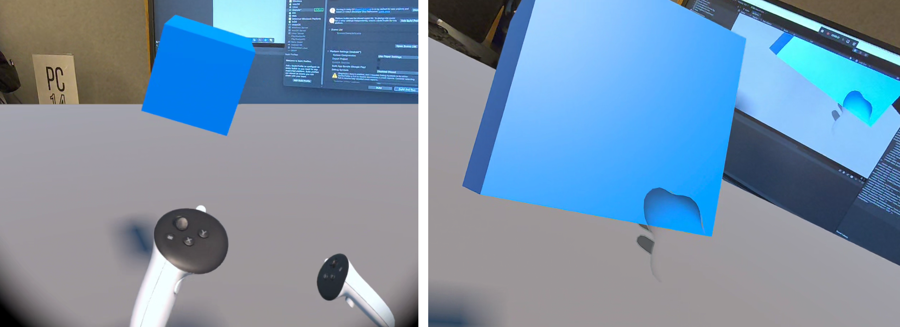

Grab the cube with your <b>controllers</b> (left) or your <b>hand</b> (right), in passthrough.

Switching between controllers and hands

To use <b>hand tracking</b>, set the controllers down and don't touch them for a second, then flex your fingers. Pick a controller back up to use the controllers again.

XR IMMERSIVE MEDIA LABPage 31

</section>
<section class="page" id="p32">

Unity 6000.3.23f1

<h2 id="troubleshooting" class="ptitle">Troubleshooting</h2>

!
<h3 id="problempassthrough-is-black-or-missing">ProblemPassthrough is black or missing</h3>

FixCheck that:
<ul class="plain"><li>The <b>Passthrough</b> and <b>Camera Rig</b> blocks are both in the scene</li><li>You ran the <b>Project Setup Tool</b> (Apply All) on <b>both</b> tabs (Step 15)</li><li>The old <b>Main Camera</b> was deleted (Step 7)</li></ul>

!
<h3 id="problema-building-block-is-greyed-out-or-won-t-add">ProblemA Building Block is greyed out or won't add</h3>

Fix

The block has a dependency. Grab needs the <b>Interaction SDK</b>, and most blocks need a <b>Camera Rig</b> in the scene. Add the <b>Camera Rig</b> block first (Step 18), and make sure the <b>All-in-One SDK</b> is installed (Step 11).

!
<h3 id="problemhands-or-controllers-don-t-appear">ProblemHands or controllers don't appear</h3>

FixCheck that:
<ul class="plain"><li>The <b>Controller Tracking</b> and <b>Real Hands</b> blocks were added (Step 19)</li><li><b>Hand tracking</b> is on in the Horizon Link developer settings (Step 5) <i>and</i> in the headset's own system settings</li></ul>
Re-run the <b>Project Setup Tool</b> if anything is missing.

XR IMMERSIVE MEDIA LABPage 32

</section>
<section class="page" id="p33">

Unity 6000.3.23f1

<h2 id="troubleshooting-cont" class="ptitle">Troubleshooting (cont.)</h2>

!
<h3 id="problemnothing-shows-when-you-press-play">ProblemNothing shows when you press Play</h3>

FixCheck that:
<ul class="plain"><li><b>Meta Horizon Link</b> is connected and the headset is on, and the <b>fix-oculus</b> shortcut was run (Step 3)</li><li>OpenXR is enabled on the <b>Windows</b> tab (Step 13), or start the <b>Meta XR Simulator</b> from Meta &rarr; Meta XR Simulator</li><li>For a full on-device install instead, use <b>Build and Run</b> (Step 22)</li></ul>

!
<h3 id="problemthe-headset-isn-t-in-the-run-device-dropdown">ProblemThe headset isn't in the Run Device dropdown</h3>

FixRe-trigger the USB prompts:

Confirm you approved the on-headset prompts (Step 22). Then, in the headset, open Settings &rarr; Developer and toggle <b>USB Debugging</b> off and back on first. If it still doesn't appear, toggle <b>MTP Notification</b> off and back on too (this re-fires the USB Detected prompt). Reconnect the cable or click Refresh in Build Profiles.

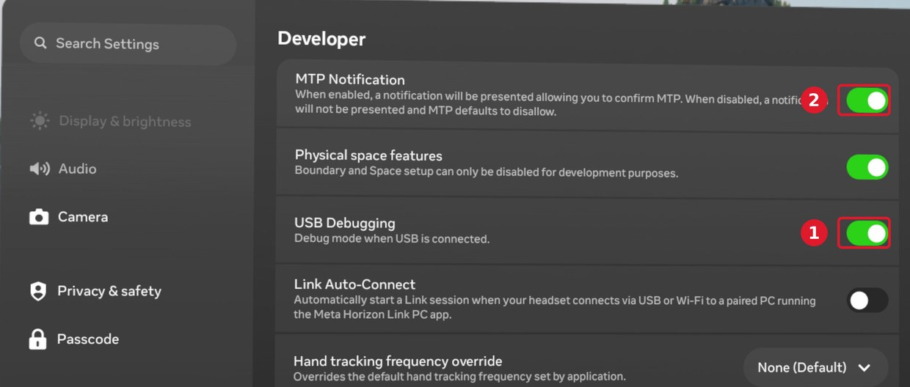

Headset &rarr; Settings &rarr; Developer: toggle <b>USB Debugging</b> (1) off/on first, then <b>MTP Notification</b> (2).

XR IMMERSIVE MEDIA LABPage 33

</section>
<section class="page" id="p34">

Unity 6000.3.23f1

<h2 id="pre-build-checklist" class="ptitle">Pre-Build Checklist</h2>

<h4 id="environment-once-per-station">Environment (once per station)</h4><label><input type="checkbox">FileWave Kiosk - "Set VR Runtime to OpenXR/Oculus" script installed</label><label><input type="checkbox">Signed in to Unity &amp; Meta Horizon Link</label><label><input type="checkbox">fix_oculus_OVR88948175 shortcut run</label><label><input type="checkbox">Horizon Link: Unknown Sources on (General)</label><label><input type="checkbox">Horizon Link: Developer Runtime Features, Passthrough over Link, Passthrough Camera API, Eye tracking, Spatial data on (Developer)</label><h4 id="project-meta-xr-sdk">Project &amp; Meta XR SDK</h4><label><input type="checkbox">Project created (Universal 3D, Unity 6.1+)</label><label><input type="checkbox">Meta XR All-in-One SDK installed (Core + Interaction, Building Blocks)</label><label><input type="checkbox">Meta XR feature group enabled - Editor restarted</label><label><input type="checkbox">Project Setup Tool: Fix All + Apply All on the Android tab</label><label><input type="checkbox">Project Setup Tool: Fix All + Apply All on the Standalone (Windows) tab</label><h4 id="building-blocks-scene">Building Blocks &amp; Scene</h4><label><input type="checkbox">Template's Main Camera deleted</label><label><input type="checkbox">Camera Rig block added</label><label><input type="checkbox">Passthrough block added</label><label><input type="checkbox">Controller Tracking &amp; Real Hands blocks added</label><label><input type="checkbox">Grab Interaction block added - [BuildingBlock] Cube in the scene</label><label><input type="checkbox">Cube resized larger and moved in front of you</label><label><input type="checkbox">Plane floor at (0, 0, 0)</label><label><input type="checkbox">Cube and Plane are not children of the Camera Rig</label><h4 id="build-test">Build &amp; Test</h4><label><input type="checkbox">Android build target - headset approved (USB debugging + file access)</label><label><input type="checkbox">Headset appears in the Run Device dropdown</label><label><input type="checkbox">Builds and runs, or plays over Horizon Link / XR Simulator</label>

    
Finished!

    
You've built a Mixed Reality scene running on the Quest 3 with the <b>Meta XR SDK</b> - passthrough, controllers, hand tracking and a grabbable cube, wired up almost entirely by Building Blocks and the Project Setup Tool.

  

XR IMMERSIVE MEDIA LABPage 34

</section>
